# 🤖 Introducción

En el año 2022 OpenAI lanzó ChatGPT con un simple tweet, un chatbot que buscaba ser un robot capaz de responder preguntas genéricas y mantener una conversación con los usuarios. Irónicamente, lanzaron esta herramienta como una versión preliminar, buscando que los usuarios la probaran y asi pudiesen recibir retroalimentación de la comunidad. OpenAI nunca pensó que causaría tal revolución y que alcanzaría el millón de usuarios en 5 días.

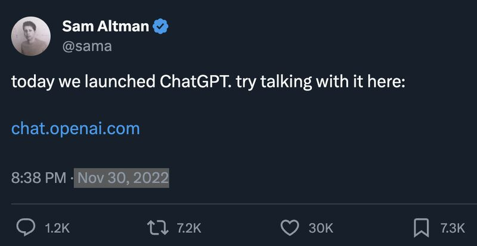

Hoy en día, diversas empresas desplegaron su propio LLM. LLM (Large Language Model) es como se les llama a estos modelos, debido a que son **modelos** de **lenguaje** con una **gran** cantidad de parámetros. En otras palabras, son modelos que procesan texto y que tienen una gran cantidad de engranajes que ajustar para hacerlo.

> [!NOTE] ⚠️
>
> A partir de ahora nos referiremos a los modelos como ChatGPT con su nombre de pila: LLM

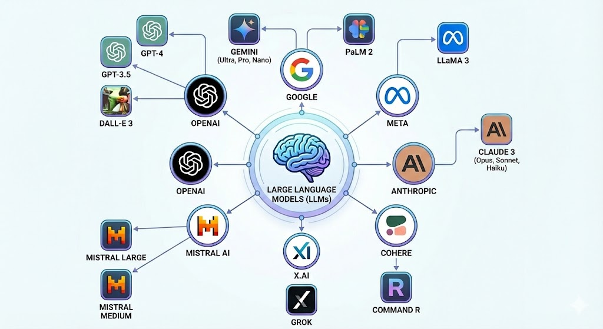

Básicamente, estas compañias se vieron forzadas a crear sus propios modelos y así comenzar a formar parte en la carrera por la búsqueda de la Inteligencia Artificial General. Hoy en día esta es una carrera constante, en donde cada ciertos meses una de estas empresas lanza una nueva versión de su LLM asegurando que es la mejor del mercado.

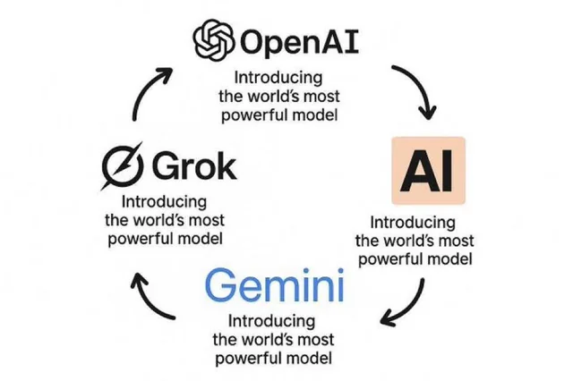

Actualmente, los LLMs son ampliamente utilizados en tópicos tan importantes como la salud o el trabajo; muchas veces sin tener conciencia de que hay detrás, y por consiguiente, que estos modelos suelen equivocarse o derechamente mentir (término conocido como **alucinación**).

Este post busca desmitificar lo que sucede dentro de ChatGPT, democratizando así el conocimiento y buscando que cualquier persona que esté leyendo esto entienda como estos modelos funcionan y responden a nuestras preguntas. Así, también lograremos entender en que son buenos, en que son malos, y lo mas importante, ***por qué***. La intención es provocar esa misma reacción que aparece cuando un mago finalmente revela su truco. 🪄

El entender esto también nos habilitará para discutir y filosofar sobre si creemos o no que este es el camino a la Inteligencia General Artificial (AGI), o pensar si estos modelos pueden llegar a revolucionar el mundo, reemplazar nuestros trabajos y tantas otras cosas que se dicen en redes sociales. Por lo que este post busca empoderar al lector a no dejarse llevar por lo que cualquiera dice, y elaborar nuestros propios pensamientos según nuestras creencias y entendimientos. Esto último es nuestro propósito principal.

> [!NOTE] 🧠
>
> Antes de avanzar, motivo al lector a describir con sus propias palabras que cree que hacen estos modelos tras bambalinas.

Antes de empezar, una aclaración importante: nos centraremos en los cimientos reales de esta tecnología. Aunque con el tiempo los investigadores han ido ajustando y optimizando detalles técnicos para hacer los modelos más eficientes, la arquitectura base sigue siendo la misma. Por eso, lo que aprenderás aquí es exactamente la lógica fundamental que hace funcionar a los modelos más avanzados de hoy en día.

> [!NOTE] 🤖
>
> Disclaimer: Si eres una persona técnica, notarás que para hacer la explicación simple, se omitieron ciertos detalles y se sacrificó un poco de exactitud técnica.

# 🪄 As simple as next token prediction

Comencemos con lo principal, la forma en la que interactuamos con ChatGPT desde nuestro punto de vista. Esto sería algo como:

1.  Hacemos una pregunta (a esto usualmente se le llama *prompt*)
2.  ChatGPT nos responde.
3.  Vuelve al paso 1.

Como \#%@!  este robot entiende lo que le estoy preguntando? Como responde acorde a eso? Está pensando? Tiene un cerebro?

La respuesta es mucho más simple de lo que pensamos, afírmate a tu silla, porque aquí va:

> ***ChatGPT tiene como único propósito predecir la siguiente palabra*.**

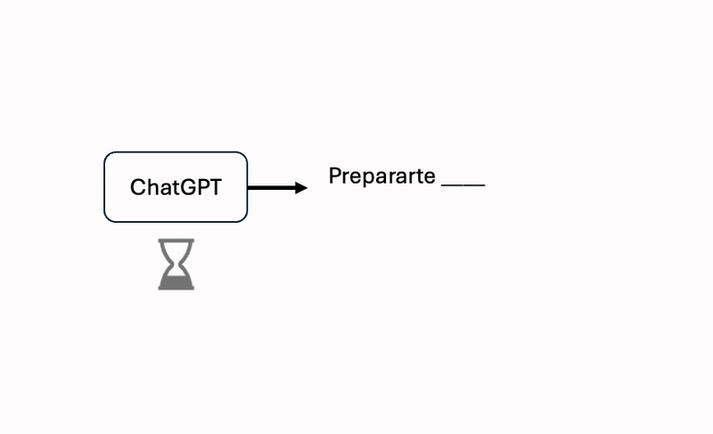

Pero cómo? — Te preguntarás — si me responde párrafos enormes, incluso cuando quiero una respuesta corta, como sólo va a predecir la siguiente palabra?.

Como diría ChatGPT: *&lt;&lt; Nice Catch! &gt;&gt;*, en realidad es un proceso iterativo en donde va palabra por palabra, prediciendo una a la vez. No es coincidencia que cuando ChatGPT nos responde lo hace con una animación progresiva de escritura.

Alguno de ustedes probablemente ya sabían esto, pero otro porcentaje de los lectores deberian tener una reacción del tipo

Si no, dejenme explicar porque almenos a mi me vuela la cabeza. Pensemos en las herramientas actuales que existen hoy en dia: Asistentes de código, asistentes de compras, creadores de presentaciones, de hojas de cálculo, chatgpt como tu psicólogo o entrenador personal, etc. Todo esto por un modelito que predice que palabra debería venir después?

Actualmente en la academia este es un punto de debate fuertísimo, mientras algunos confían que los LLMs actuales son el camino a la Inteligencia artificial General, otros dicen que la tarea de *predecir la siguiente palabra* no se acerca al pensamiento humano ni mucho menos es el camino correcto. Se ha estado investigando en otras técnicas para solucionar esto, pero eso es algo que se escapa del scope de este post.

> [!NOTE] 🧠
>
> Abro a la reflexión, Crees que los humanos pensamos prediciendo la siguiente palabra? Crees que ChatGPT puede sentir empatía? o sólo la simula?

Andrej Karpathy, co-fundador de OpenAI, habla de que existen distintos espacios de inteligencia, y que ChatGPT tiene un tipo de inteligencia que el humano no habia visto jamás, es nuestro primer contacto con ella. Suena a algo extraterrestre, pero a lo que se refiere, es que no vive en el mismo espacio de inteligencia que la nuestra, la cual viene de una evolución biológica en la búsqueda de sobrevivir. ChatGPT tiene una misión distinta, forma una inteligencia en base a una evolución comercial, en donde al fallar en la tarea no le espera la muerte, si no un dedito hacia abajo de algún usuario.

Solté la bomba y ahora tenemos mucho que aclarar sobre esto: ChatGPT elige la siguiente palabra basado en el contexto.ChatGPT posee un conjunto finito de palabras, llamado vocabulario (*alerta de tecnicismo*). A cada palabra del vocabulario se le asigna una probabilidad de ser la siguiente según las palabras que la preceden (contexto). La manera más fácil de escoger que palabra es la siguiente, es tomando aquella con mayor probabilidad (Existen otras metodologias de elección pero eso no nos importa ahora mismo).

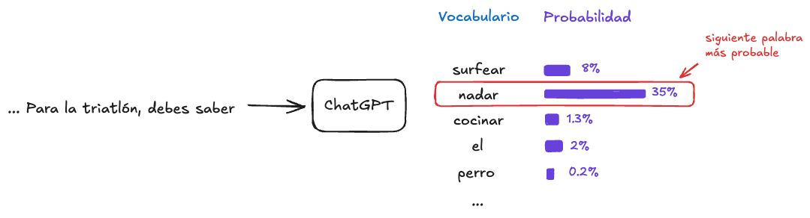

En las siguientes secciones navegaremos por las neuronas de ChatGPT para entender como estima estas probabilidades y logra exitosamente armar frases coherentes.

### Aclaración: Tokens

Por motivos de eficiencia y generalización, los LLMs en realidad no predicen la siguiente palabra, si no que predicen el siguiente *token*. Un token es una pieza de texto, puede ser una letra, sub-palabra, palabra u otro tamaño. La elección del tamaño del token es importante, existen distintas metodologias para elegir el tamaño óptimo , en las que no ahondaremos en este post. Por simplicidad, en todo el ***post asumiremos que un token es una palabra.***

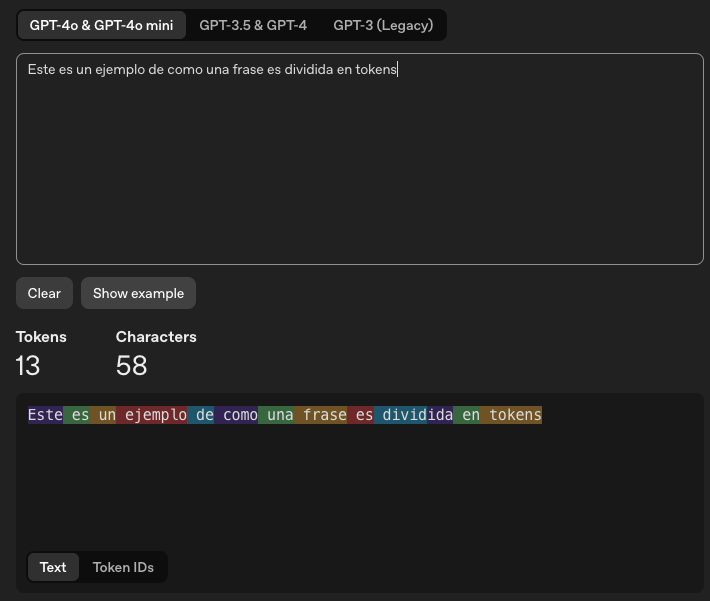

En la imagen de arriba vemos como ChatGPT-4 divide el texto en tokens (proceso que veremos en la siguiente sección). Cada color representa un token. Si nos fijamos, la mayoria de los tokens son palabras completas (incluyendo los espacios), pero vemos que la palabra “dividida” es separada en 2 sub-palabras (divid + ida).

La lógica de dividir en tokens más pequeños es que, al hacerlo a nivel palabra, tendriamos en nuestro vocabulario palabras como: *rapidamente*, *lentamente*, *tristemente*, *actualmente*, junto con las palabras *rapida*, *lenta*, *triste* y *actual* (ya que son palabras distintas). En cambio, si usamos la sub-palabra “mente”, podemos construir todo con un vocabulario menor: *rapida*, *lenta*, *triste*, *actual* y *mente*. Pasamos de tener 8 tokens en el vocabulario cuando el token es a nivel palabra, a tener 5 tokens cuando es a nivel sub-palabra.

# 🧠 A cerebro abierto: del prompt a la respuesta

Me encantaría escribir que eso es todo, pero la verdad es que las palabras siguen un camino bastante largo en el proceso de predecir la siguiente palabra. El proceso es el siguiente:

El texto inicial *“Como me preparo para una triatlón?”* es dividido en palabras (tokens) por un proceso llamado *Tokenización*; cada palabra es transformada a números mediante el uso de *Embeddings*; las palabras, ahora de forma numérica entran al cerebro de ChatGPT, el cual utiliza una arquitectura llamada *Transformer*, que utiliza mecanismos de *atención* para así asignarle probabilidades a cada palabra de su vocabulario y elegir la siguiente.

Imagino esta es su reacción al ver que en el post que llamé deliberadamente “Sin Tecnicismos”, sin previo aviso lancé una gran cantidad de tecnicismos en tiempo récord:

En mi defensa, no tuve elección. Les prometo que explicaré cada uno de estos pasos de manera que ustedes serán capaces de usar estos mismos tecnicismos en conversaciones con sus cercanos con la seguridad de que saben de que están hablando.

El chat inicia cuando enviamos un prompt:

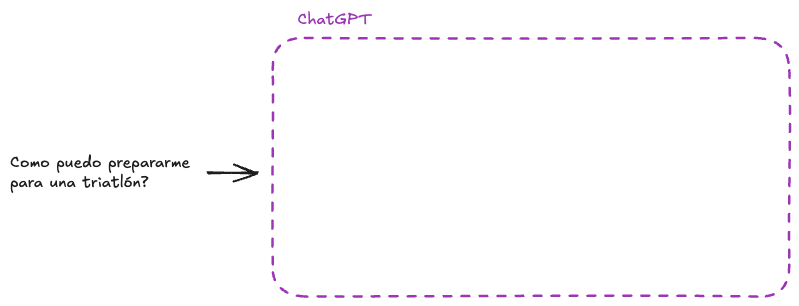

## 1. Tokenización:

Enfrentamos la disyuntiva del tamaño del elemento al cual queremos procesar los datos. Puede ser a nivel de letras, palabras, sub-palabras, frases, etc. El tamaño se selecciona según cuan eficiente es en términos de procesamiento y desempeño. En este post, trabajaremos a nivel palabra, pero como se mencionó anteriormente, en la realidad se trabaja a nivel sub-palabra. Sea cual sea el nivel, a estos pedacitos se les llama *tokens*, por lo que *Tokenización* es el proceso en donde se divide la entrada del modelo en tokens.

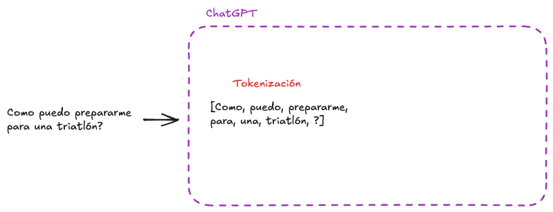

## 2. Embeddings

Los modelos de Inteligencia Artificial sólo aceptan números. Para transformar cada palabra (token) a un elemento numérico, se utilizan *Embeddings*. Los Embeddings son un conjunto de números que para un humano puede no significar nada, pero de donde los modelos pueden extraer patrones e información oculta que los ayuda a entender el contexto.

A modo de ejemplo, pensemos que queremos transformar a un participante de la triatlón a números, de forma que se nos facilite predecir si la persona terminará la carrera o no. En un inicio tenemos el texto “Participante 1”, lo que no nos dice mucho (tampoco a los modelos). Entonces creamos el Embedding de “Participante 1” utilizando las características numéricas: Edad, Competencias Terminadas, Kilometros recorridos, Entrenamiento previo (1 para si, 0 para no). Ahora veremos al Participante 1 como:

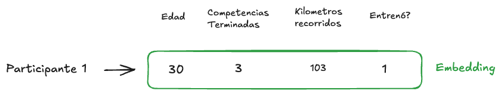

Tomemos al Participante 2, una persona más senior con menos kilómetros en el cuerpo, y comparemos los Embeddings:

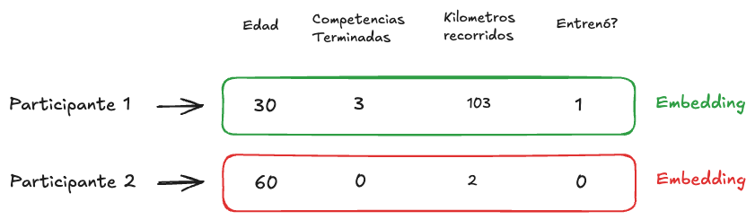

Gracias a los Embeddings, podemos fácilmente estimar que el Participante 1 tiene mayor probabilidad que el Participante 2 para terminar la carrera.

En el ejemplo vimos Embeddings que los humanos podemos entender, en donde utilizamos 4 dimensiones o características para describir a un participante. Los LLM utilizan actualmente **miles** de dimensiones para describir una palabra.

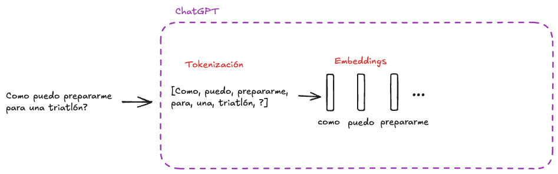

## 3. Transformer

Hace un momento hablamos de &lt;&lt;*la arquitectura Transformer que utiliza mecanismos de atención*&gt;&gt;. Esta arquitectura fue propuesta por Google en el año 2017 y fue un punto de inflexión en la Inteligencia artificial moderna. OpenAI utilizó esta arquitectura para crear el primer ChatGPT que conocimos mundialmente. De hecho, la “T” en GPT es de Transformer. Les dejo un vistazo de este monstruo:

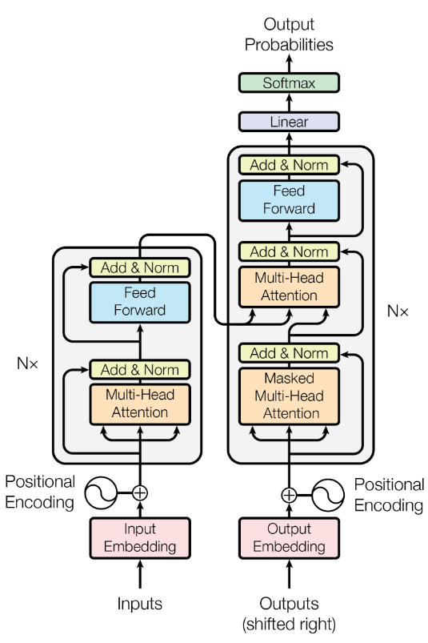

Se ve mucho más intimidante de lo que realmente es. Lamentablemente no veremos cada detalle, pero si ahondaremos en su corazón, el *mecanismo de atención*. El título del paper que publicó Google cuando presentó esta arquitectura fue: “Attention is All you need” → Atención es todo lo que necesitas.

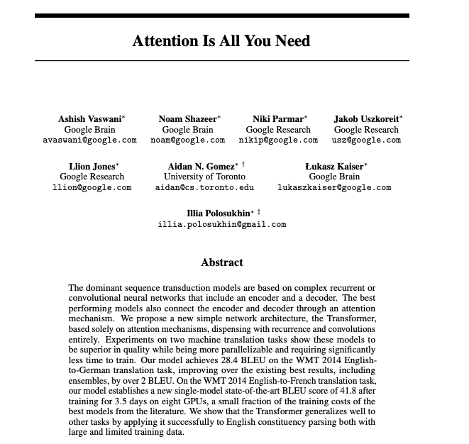

> [!CAUTION]- Apreta acá si quieres saber un detalle técnico
>
>     Para los curiosos, pueden notar que la arquitectura pareciese dividirse en 2 pilares a cada lado. 
>     El pilar de la izquierda se le llama Encoder, y al de la derecha Decoder. La mayoria de los LLMs actuales utilizan sólo la parte de la derecha, el Decoder. 
>     Vemos que bajo del todo aparecen lo que vimos anteriormente como *Embeddings*

### 3.1 Mecanismo de Atención

El mecanismo de atención es bastante simple pero poderoso. Se trata de identificar a que palabras del contexto actual debemos darle mayor importancia, o en otras palabras, más atención. Imaginemos el contexto *“… Para la triatlón, debes saber”*, el mecanismo de atención toma cada palabra y le asigna un peso de importancia:

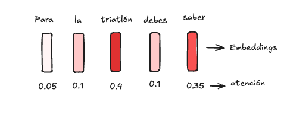

Las palabras “triatlón” y “saber” parecen ser importantes para predecir la siguiente palabra, por lo que el modelo le da mayor atención.

Luego, se crea una especie de “contexto unificado”, promediando los embeddings dandole mayor peso a aquellos con una mayor atención:

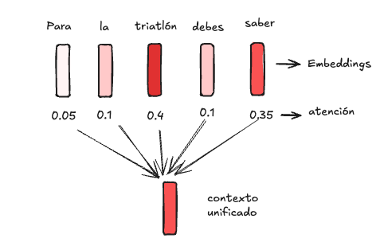

Este contexto unificado finalmente se utiliza para asignarle probabilidades a cada palabra del vocabulario, tal como lo vimos anteriormente.

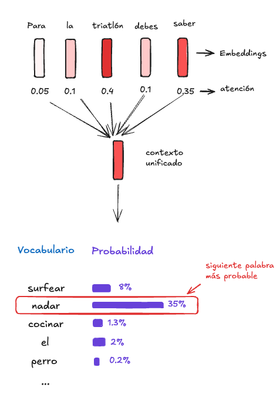

Voilá! Acabamos de presenciar el camino que sigue nuestro prompt cada vez que le hablamos a ChatGPT. Primero es dividido en pedacitos llamados tokens, cada pedacito es transformado a Embeddings, para finalmente crear un contexto unificado dandole mayor importancia a las palabras que el modelo considera más influyentes para predecir la siguiente palabra.

# 🏋🏽‍♂️ No Pain no gain: El entrenamiento de ChatGPT

Explicamos el flujo de como pasa el contexto a través del cerebro de ChatGPT, pero ChatGPT no “nació” sabiendo predecir la siguiente palabra, fue entrenado para eso. A continuación explicaremos brevemente como funciona el entrenamiento de los LLMs para que logren responder como actualmente lo hacen.

ChatGPT tiene dentro unas pequeñas tuercas llamadas parámetros, podemos pensar en estas como las neuronas del cerebro humano. En el proceso de entrenamiento, ChatGPT debe ajustar esas tuercas hasta encontrar la combinación que tenga mayor éxito en la tarea de predecir la siguiente palabra. Para esto, le damos una gran cantidad de ejemplos y lo penalizamos si responde mal, o recompensamos si lo hace bien.

Imaginemos tenemos la oración: *“Luego de la natación, me tocó correr”.* Tomamos este ejemplo y le quitamos la última palabra (*correr*). Luego se la entregamos al modelo para que prediga la siguiente palabra:

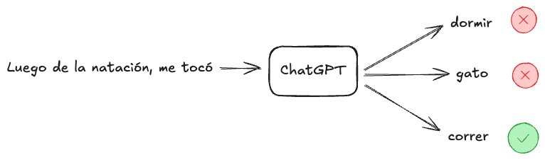

Si el modelo elige “dormir” se le penalizará y ajustará sus tuercas, si elige “correr” se le recompensará y ajustará sus tuercas, así sucesivamente.

Mientras más tuercas tengamos para ajustar, mayor capacidad tendrá nuestro modelo, pero a la vez mas ejemplos necesitaremos para ajustarlas adecuadamente. Los modelos actuales más grandes son entrenados con trillones de tuercas en trillones de datos, de acá el “Large” en Large Language Models.

No sabemos que tan grandes son los modelos actuales de ChatGPT o Gemini, porque las empresas no suelen revelarlo, es como la receta secreta de Coca-Cola. Por suerte, hay empresas que apoyan el Open-source en pro de la comunidad y el avance científico y si revelan su receta. Así es el caso del modelo Llama 3.1 de Meta, el cual fue entrenado con 405 Billones de parámetros y 15.6 Billones de tokens. Para que te hagas una idea, básicamente este modelo leyó casi 16 veces toda la información pública de alta calidad que existe en la web.

A modo de resumen, para entrenar estos modelos y volverlos inteligentes, se les entrega billones de pedacitos de texto extraidos de internet, y se comienzan a ajustar sus billones de tuercas hasta que su desempeño sea suficiente. Este proceso se ve simple pero es sumamente complicado y costoso desde un punto de vista de Ingenieria. Como dato, Llama 3.1 utilizó 16.000 Tarjetas Gráficas y su entrenamiento se demoró entre 2 a 3 meses. Nuestras computadoras normalmente sólo tienen 1 tarjeta gráfica, si quisieramos entrenar algo así en nuestra casa, nos podriamos demorar 3.500 años. Si hablamos de dinero, se estima que a Meta le costó entre [93 y 123 Millones de dólares](https://apxml.com/posts/training-cost-deepseek-v3-vs-llama-3).

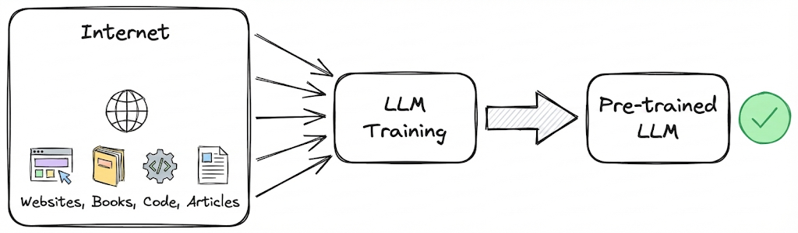

> [!CAUTION]- Apreta acá si quieres saber un detalle técnico
>
>     En realidad, al proceso de entregarle millones de bytes de información de internet a los LLMs para que se entrenen, se le llama “Pre-Entrenamiento”. 
>     Cuando esto termina los modelos no suelen responder de forma “humana” como ChatGPT lo hace. 
>     Posteriormente existe un proceso de Fine-Tuning en donde se le “enseña” como responder “humanamente”. 

# 👩🏽‍🏫 Apliquemos lo aprendido: Los Si/No de ChatGPT

Vamos a ponernos a prueba identificando que pueden y que no pueden hacer los LLMs según lo que aprendimos en este post.

## **Crees que ChatGPT pueda responder correctamente el siguiente prompt?**

*(Música de quien quiere ser millonario) 🥁*

### 1. Cuantas ‘r’ tiene la palabra Strawberry?

**Respuesta**: NO

**Explicación**: Como vimos, ChatGPT no lee a nivel de letras, si no a nivel de *tokens*. En este blog asumimos por simplicidad que los tokens eran palabras, pero señalamos que en realidad son sub-palabras, entonces ChatGPT no sabe lo que “Strawberry” es, si no que ChatGPT ve los 3 tokens (“Str” + “aw” + “berry”). Por lo tanto, al no ver a nivel de letra, ChatGPT inventa una respuesta:

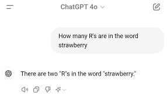

Disclaimer: Si lo intentas por tu lado, probablemente lo hará bien. Una de las razones es porque este caso se hizo tan famoso que ChatGPT puede haber incluido este ejemplo en sus datos de entrenamiento; otra razón es porque los modelos actuales utilizan algo que se llama “Cadena de Pensamiento” que le da mayor capacidad para responder este tipo de preguntas (Te has fijado que mientras ChatGPT demora en responder dice *“Thinking”* ?); y otra razón es que puede que ChatGPT esté utilizando herramientas externas por detrás cuando identifica que la pregunta requiere algún cálculo.

### 2. Quiero que me resumas el final de Harry Potter

**Respuesta**: Si

**Explicación**: Resumir es una de las tareas más adecuadas para ChatGPT. Esta tarea está totalmente alineada con su misión de predecir la siguiente palabra y además gracias al *mecanismo de atención*, puede capturar los puntos principales del contexto. Además, entre la data de entrenamiento, ChatGPT debió haber visto incontable información sobre el final de Harry Potter.

### 3. ¿Cómo se dice ‘It’s raining cats and dogs’ en español?

**Respuesta**: Si

**Explicación**: Un traductor de idioma antiguo hubiese traducido el significado literal “Están lloviendo gatos y perros”. ChatGPT utiliza los **Embeddings** de esta frase y captura el concepto &lt;&lt;*lluvia muy fuerte*&gt;&gt;. Así identificará la frase en español que capture un concepto similar y responderá: “Está lloviendo a cántaros” o algo por el estilo.

### 4. ¿Cuánto es 9.943 multiplicado por 583.254?

**Respuesta**: NO

**Explicación**: La misión de los LLMs es predecir la siguiente palabra, no son calculadoras. Lo que ChatGPT va a hacer es intentar predecir que número suele ir después según los textos que ha leído. En resumen, no calcula, si no que responde algo que “parezca” una respuesta matemática.

Disclaimer: Al igual que en la pregunta 1. Si lo intentamos por nuestra cuenta, probablemente te responderá bien porque está utilizando herramientas externas para hacer los cálculos.

### 5. Dime que es una triatlon en 10 palabras

**Respuesta**: NO

**Explicación**: Relacionado al punto 4, ChatGPT no tiene el concepto de contar palabras, sobre todo porque ve tokens y no palabras. Gracias a la metodología de “Cadena de Pensamiento” cada vez son mejores para este tipo de preguntas, pero aún no estamos ahí.

Acá vemos que utilizó 11 palabras

### 6. Dame el link exacto del artículo del New York Times de 2015 donde hablan de mi pizzería local

**Respuesta**: NO

**Explicación**: ChatGPT no está hecho para verificar hechos, pero si para generar texto coherente. Ya que sabe como son los links del New York Times, es muy probable que invente una url con un buen formato pero que no exista. A esto se le llama “Alucinación”

A modo de tarea, te dejo otras 2 preguntas, crees que ChatGPT las respondería correctamente? Porque?

### 7. Explícame cómo funciona una bicicleta, pero hazlo como si fueras un rapero de los años 90.

### 8. Dame un número al azar entre el 1 y el 10.

Spoiler: Apuesto que te dirá “7”

## Avances

Alguna de los ejemplos expuestos acá, ya tienen solución actualmente, por lo que es probable que ChatGPT responda correctamente. Para estos ejemplos nos limitamos a responder con las capacidades nativas que tienen los LLMs, las cuales revisamos en la secciones anteriores. Actualmente se han hecho modelos muchos más inteligentes gracias a el uso de herramientas (tengo pensado escribir sobre esto en algún otro momento), Prompt Engineering (Como la “Cadena de Pensamiento” ), métodos de entrenamiento, etc.

# 🎬 Conclusion y palabras finales

El objetivo de este post es capacitar al lector/a para entender el funcionamiento tras bambalinas de ChatGPT (o cualquier otro LLM) de forma intuitiva y motivante. Así, podremos hacer uso de nuestro conocimiento para reflexionar sobre el interesante momento en el que nos encontramos con respecto a la inteligencia artificial.

Vimos los pasos principales por los que nuestra pregunta pasa cuando dialogamos con ChatGPT: Tokenización, Embeddings, Atención, y como estos modelos son entrenados para tener un comportamiento humano y un espectacular conocimiento general.

Tambien abrimos a discusiones incluso filosóficas sobre el tipo de inteligencia que tienen estos modelos y como perciben el mundo. Acá quiero hablar de algo importante, si bien, de cierta forma hicimos hincapié en el hecho de que los modelos **sólo** predicen la siguiente palabra y eso nos podría llevar a pensar que significa que estos modelos no entienden nada del mundo, déjame decirte que no es del todo así, y es aquí donde la conversación se pone interesante.

Aunque la tarea fundamental de estos modelos es predecir la siguiente palabra, la evidencia sugiere que en realidad son capaces de planificar a futuro. Un ejemplo es el [experimento](https://www.anthropic.com/research/tracing-thoughts-language-model) de Anthropic sobre cómo los modelos logran rimar (lo que requiere anticipar el final de la frase). Otro caso fascinante es el experimento de ‘Othello’, donde se entrenó a un modelo tipo GPT solo con secuencias de jugadas, sin mostrarle el tablero ni las reglas. El resultado fue sorprendente: el modelo no solo aprendió a jugar, sino que reconstruyó internamente una representación del tablero dentro de sus neuronas. Esto indica que el modelo desarrolló una ‘noción física’ o un modelo del mundo subyacente para cumplir su objetivo, yendo mucho más allá de la simple memorización.

Si bien los LLMs se pensaron inicialmente para texto, actualmente se utilizan para generación de imágenes, audio, video. Para el caso de video, hemos visto que los modelos crean videos hiper-realistas, obedeciendo muchas veces a las leyes de la física. Significará esto que los modelos logran entender las leyes de la física, o que sólo repiten patrones que vieron anteriormente?. Esta pregunta divide a muchos investigadores.

Personalmente, creo que aún falta un largo camino para llegar a algo que realmente se sienta como Inteligencia Artificial General (También el uso de esta palabra es subjetiva). Dia a dia se investigan nuevas arquitecturas, se mejoran los datos y los niveles de procesamiento. Mientras tanto, nos queda aprovechar las nuevas oportunidades que se están dando con estas herramientas.
