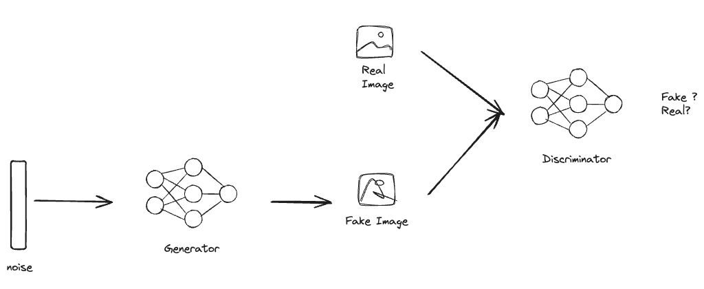

# GAN: Paper Implementation

[](https://github.com/diegulio/GAN-Paper-Implementation)

# 📝 Tópico: GAN Paper Implementation

En este post, implementaremos un paper (SPOILER: en realidad serán 2) desde 0, esto con el fin de mostrar todo lo que se puede aprender de este proyecto y motivar al lector a intentarlo. Intentaré narrar este post como un "diario de vida", mostrando los desafíos que superé, y los que no. Los papers a implementar en esta ocasión serán:

- [**Generative Adversarial Networks**](https://arxiv.org/abs/1406.2661)
- [**Unsupervised Representation Learning with Deep Convolutional Generative Adversarial Networks**](https://arxiv.org/abs/1511.06434)

Elegí el primero ya que evalué que era un paper totalmente implementable desde el punto de vista técnico, era un modelo y algoritmo "simple" de implementar y no se necesitaría mucho cómputo. El segundo lo implementé sólo con la intención de mejorar los resultados del primero, y con el objetivo de seguir aprendiendo!

> [!NOTE]
> No me centraré demasiado en aspectos técnicos de alto nivel, como el uso básico de Pytorch. El lector puede consultar internet o mi post **Image Classification with Pytorch Lightning** si está interesado.

# Motivación: Implementar un Paper

Una muy buena práctica que grandes mentes en tecnología normalmente recomiendan es implementar un paper. Esto hace mucho sentido, ya que con esto realmente nos ensuciamos las manos con los algoritmos, ponemos atención a detalles técnicos, aprendemos nuevas metodologías, mejora sustancialmente nuestros skills técnicos, y finalmente nos ayuda a leer mejor los papers.

Personalmente, a veces navego por Kaggle viendo soluciones, donde muchas veces los ganadores utilizan soluciones hechas "a mano". Con esto me refiero a no simplemente llamar un modelo y ejecutar el `.fit()`, si no que crear la estructura de tu modelo desde 0, e incluso innovar en la rutina de entrenamiento. En ocasiones, los puntitos de performance que se gana con esto hace la diferencia en el Leaderboard.

La ofuscación me recorre cuando me doy cuenta que yo no sería capaz de implementar algo así (siempre lo pienso sin siquiera intentarlo). Es por esto que me decidí a pasar por este proceso, y me propuse implementar un paper que me llame la atención, y apuntar a obtener los mismos resultados (caso ideal).

En este post, no quiero sólo mostrar la solución final, porque siento que eso desalienta al lector, haciéndolo creer que llegué a la solución al primer intento. En esta ocasión, mostraré la mayoría de los desafíos por los que tuve que pasar, los éxitos y los fracasos; el paso a paso de como llegué a lo que sería mi solución final.

# 🔨 Tool Path: Que utilizaremos

1. **Pytorch**: es una biblioteca de código abierto para el desarrollo de aplicaciones de aprendizaje profundo y la investigación en inteligencia artificial.

# 💭 Concept Path: Que aprenderemos

1. Generative Adversarial Networks
2. Convolutional Neural Networks
   - Downsampling
   - Upsampling

# ♟️ Estrategia: Como abordamos

La estrategia fue la siguiente:

1. **Vencer el Síndrome del Impostor**: Tarea difícil, por ahora metámonos en la cabeza que nosotros también somos capaces de crear cosas, y que no es tan difícil como lo creemos.
2. **Buscar un Paper para leer**: Acá debemos considerar algunas limitaciones.
3. **Leer el Paper**: Existen algunos tips en la forma de leer un paper.
4. **Implementar**: Acá se encuentra la complejidad técnica.
5. **Ver resultados**: A cruzar los dedos y esperar tener resultados similares 🤞🏽

# 🧠 Prototyping: GAN

Comenzaremos con el paper Generative Adversarial Networks. Yo no soy experto en leer papers, existen algunos tips para esto, como el saltarse algunas secciones que pueden no ser muy interesantes o el orden en el cual deberiamos leer, pero todo esto normalmente es para ocasiones en donde estas leyendo para conocer el estado del arte. En este momento, ya que queremos implementar la solución, yo simplemente opté por leer todo el paper (no es tan largo).

A medida lo leía, intentaba entender todo lo necesario para implementarlo, cada vez que no entendía algún término o técnica utilizada, lo googleaba, esto me llevó a aprender muchas cosas nuevas.

## Generative Adversarial Networks

A grandes rasgos, en este paper muestran un nuevo camino para la generación de información. Es importante que sólo le digamos camino, porque no buscan traer la mejor solución que promete superar a todo, si no que remarcan que el objetivo es dar a conocer una forma prometedora en la que se podría generar información, y que con el tiempo podria traer grandes resultados con ayuda de la comunidad investigadora. No sólo generar imágenes, si no también otros tipos de información como audio o texto.

Efectivamente, esta metodología marcó un antes y un después para la generación de imágenes, que luego fue superada por los modelos de difusión debido a la inestabilidad y dificultad de entrenamiento que las GAN traen. Aún así, la comunidad mejoró este primer paper trayendo una gran cantidad de GANs al mundo, logrando grandiosos resultados (DCGAN, cGAN, styleGAN, CycleGAN, etc).

En resumen, esta metodología consta de 2 modelos, un **Generador** y un **Discriminador**. La misión del **Generador** es, como lo indica su nombre, generar imágenes que sigan la misma distribución que el conjunto de datos, esto de forma indirecta, ya que en realidad lo entrenamos para que logre engañar al **Discriminador**. El **Discriminador**, por otro lado, es entrenado para clasificar entre imágenes provenientes de la data real e imágenes generadas por el **Generador**.



## 👨🏾‍💻 Implementando GAN

Según el paper, para implementar la solución, necesitamos 3 componentes:

1. Generador
2. Discriminador
3. Rutina de Entrenamiento

El objetivo es construir un modelo que genere imágenes que provengan de la misma distribución que nuestro conjunto de datos (que se parezcan). En esta ocasión utilizaremos el conocido conjunto de datos MNIST, ya que es uno de los utilizados en el paper y es bastante simple de encontrar y utilizar.

> We trained adversarial nets an a range of datasets including MNIST, the Toronto Face Database (TFD), and CIFAR-10.

Acá un vistazo de como luce el conjunto de datos MNIST (son imágenes de números escritos a mano):


### 1. Generador

Leamos que dice el paper sobre esto:

> To learn the generator's distribution $p_g$ over data $x$, we define a prior on input noise variables $p_z(z)$, then represent a mapping to data space as $G(z;\theta_g)$, where $G$ is a differentiable function represented by a multilayer perceptron with parameters $\theta_g$.

Lo que se entiende de acá es que nosotros definiremos una distribución a priori para el input $z$ del generador $G$. Este ruido $z$ es luego transformado por el Generador (una red neuronal) para obtener una imagen generada que sigue la distribución $p_g$. Nuestro objetivo entonces es que la distribución $p_g = p_{data}$.

```python
import torch
import torch.nn as nn

class Generator(nn.Module):
    def __init__(self, z_dim, img_dim):
        super().__init__()
        self.gen = nn.Sequential(
            nn.Linear(z_dim, 256),
            nn.LeakyReLU(0.01),
            nn.Linear(256, img_dim),
            nn.Tanh(),  # normalize inputs to [-1, 1]
        )
    def forward(self, x):
        return self.gen(x)
```

### 2. Discriminador

El discriminador es simplemente un clasificador binario:

```python
class Discriminator(nn.Module):
    def __init__(self, in_features):
        super().__init__()
        self.disc = nn.Sequential(
            nn.Linear(in_features, 128),
            nn.LeakyReLU(0.01),
            nn.Linear(128, 1),
            nn.Sigmoid(),
        )
    def forward(self, x):
        return self.disc(x)
```

### 3. Rutina de Entrenamiento

> The minimax game: $\min_G \max_D V(D, G) = \mathbb{E}_{x \sim p_{data(x)}}[\log D(x)] + \mathbb{E}_{z \sim p_z(z)}[\log(1 - D(G(z)))]$

La rutina de entrenamiento alterna entre entrenar al Discriminador y entrenar al Generador:

```python
# Hyperparameters
device = "cuda" if torch.cuda.is_available() else "cpu"
lr = 3e-4
z_dim = 64
image_dim = 28 * 28 * 1  # 784
batch_size = 32
num_epochs = 50

disc = Discriminator(image_dim).to(device)
gen = Generator(z_dim, image_dim).to(device)
fixed_noise = torch.randn((batch_size, z_dim)).to(device)
opt_disc = optim.Adam(disc.parameters(), lr=lr)
opt_gen = optim.Adam(gen.parameters(), lr=lr)
criterion = nn.BCELoss()

for epoch in range(num_epochs):
    for batch_idx, (real, _) in enumerate(loader):
        real = real.view(-1, 784).to(device)
        batch_size = real.shape[0]

        ### Train Discriminator: max log(D(x)) + log(1 - D(G(z)))
        noise = torch.randn(batch_size, z_dim).to(device)
        fake = gen(noise)
        disc_real = disc(real).view(-1)
        lossD_real = criterion(disc_real, torch.ones_like(disc_real))
        disc_fake = disc(fake).view(-1)
        lossD_fake = criterion(disc_fake, torch.zeros_like(disc_fake))
        lossD = (lossD_real + lossD_fake) / 2
        disc.zero_grad()
        lossD.backward(retain_graph=True)
        opt_disc.step()

        ### Train Generator: min log(1 - D(G(z))) <-> max log(D(G(z)))
        output = disc(fake).view(-1)
        lossG = criterion(output, torch.ones_like(output))
        gen.zero_grad()
        lossG.backward()
        opt_gen.step()
```

## Primeros Resultados

Luego de unas pocas epochs de entrenamiento, así lucen las imágenes generadas por la GAN:


Se puede ver que el modelo comienza a aprender la distribución de los dígitos del dataset MNIST. Aún hay mucho ruido, pero la dirección es correcta.

# 🧠 Prototyping: DCGAN

La GAN original utiliza redes *fully connected* (solo capas lineales). El paper DCGAN propone usar capas convolucionales, lo que mejora significativamente la calidad de las imágenes generadas.

## Deep Convolutional GAN (DCGAN)

Las diferencias clave con la GAN original:

- **Generador**: Usa capas `ConvTranspose2d` para hacer upsampling
- **Discriminador**: Usa capas `Conv2d` para hacer downsampling
- **Batch Normalization**: Se aplica en todas las capas excepto la última del Generador y la primera del Discriminador
- **Activaciones**: `LeakyReLU` en el Discriminador, `ReLU` en el Generador (excepto la última capa que usa `Tanh`)

```python
class DCGenerator(nn.Module):
    def __init__(self, channels_noise, channels_img, features_g):
        super(DCGenerator, self).__init__()
        self.net = nn.Sequential(
            # Input: N x channels_noise x 1 x 1
            self._block(channels_noise, features_g * 16, 4, 1, 0),  # 4x4
            self._block(features_g * 16, features_g * 8, 4, 2, 1),  # 8x8
            self._block(features_g * 8, features_g * 4, 4, 2, 1),   # 16x16
            self._block(features_g * 4, features_g * 2, 4, 2, 1),   # 32x32
            nn.ConvTranspose2d(features_g * 2, channels_img, kernel_size=4, stride=2, padding=1),
            nn.Tanh(),
        )

    def _block(self, in_channels, out_channels, kernel_size, stride, padding):
        return nn.Sequential(
            nn.ConvTranspose2d(in_channels, out_channels, kernel_size, stride, padding, bias=False),
            nn.BatchNorm2d(out_channels),
            nn.ReLU(),
        )

    def forward(self, x):
        return self.net(x)


class DCDiscriminator(nn.Module):
    def __init__(self, channels_img, features_d):
        super(DCDiscriminator, self).__init__()
        self.disc = nn.Sequential(
            # Input: N x channels_img x 64 x 64
            nn.Conv2d(channels_img, features_d, kernel_size=4, stride=2, padding=1),
            nn.LeakyReLU(0.2),
            self._block(features_d, features_d * 2, 4, 2, 1),
            self._block(features_d * 2, features_d * 4, 4, 2, 1),
            self._block(features_d * 4, features_d * 8, 4, 2, 1),
            nn.Conv2d(features_d * 8, 1, kernel_size=4, stride=2, padding=0),
            nn.Sigmoid(),
        )

    def _block(self, in_channels, out_channels, kernel_size, stride, padding):
        return nn.Sequential(
            nn.Conv2d(in_channels, out_channels, kernel_size, stride, padding, bias=False),
            nn.BatchNorm2d(out_channels),
            nn.LeakyReLU(0.2),
        )

    def forward(self, x):
        return self.disc(x)
```

## Resultados DCGAN


Los resultados con DCGAN son notablemente mejores. Las imágenes generadas tienen más coherencia estructural y menos ruido.

# 🎯 Resultados Finales


Logramos replicar los resultados del paper. Algunos puntos clave del aprendizaje:

- La **inestabilidad** del entrenamiento GAN es real — es muy fácil que el discriminador "gane" demasiado rápido y el generador nunca aprenda
- El **learning rate** y el balance entre entrenar discriminador y generador son críticos
- DCGAN representa una mejora sustancial sobre la GAN original al incorporar convoluciones
- Implementar un paper desde cero es una de las mejores formas de aprender en profundidad

# 🚀 Próximos Pasos

- Experimentar con **Conditional GAN (cGAN)** para generar imágenes de clases específicas
- Probar con datasets más complejos (CelebA, CIFAR-10)
- Implementar **Wasserstein GAN** para mayor estabilidad en el entrenamiento
- Explorar **StyleGAN** para imágenes de mayor resolución

# 🥳 Conclusión

Implementar el paper de Generative Adversarial Networks fue un gran desafío y una enorme fuente de aprendizaje. Desde entender la teoría matemática del juego minimax hasta debuggear por qué el generador no convergía, cada paso del proceso reveló nuevos insights sobre deep learning.

Lo más valioso fue comprobar que **sí es posible** implementar papers desde cero con los conocimientos correctos y la perseverancia adecuada. Si estás pensando en hacerlo, ¡anímate! El código completo está disponible en GitHub.
