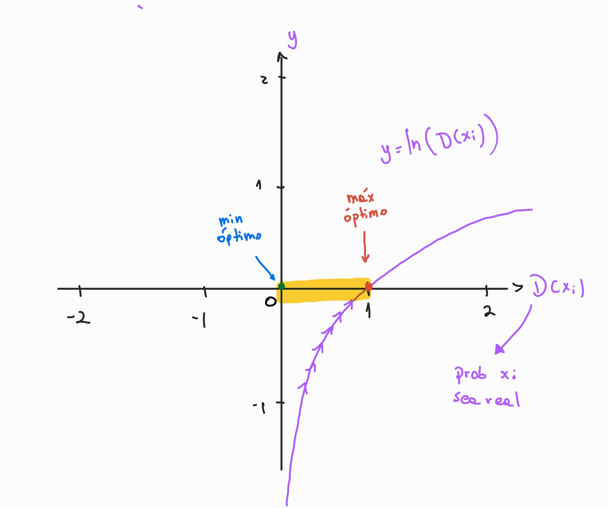

[](https://github.com/diegulio/paper_implementations)

# 📝 Tópico: GAN Paper Implementation

En este post, implementaremos un paper (SPOILER: en realidad serán 2) desde 0, esto con el fin de mostrar todo lo que se puede aprender de este proyecto y motivar al lector a intentarlo.  Intentaré narrar este post como un “diario de vida”, mostrando los desafíos que superé, y los que no. Los papers a implementar en esta ocasión serán: 

- [**Generative Adversarial Networks**](https://arxiv.org/abs/1406.2661)
- **[Unsupervised Representation Learning with Deep Convolutional Generative Adversarial Networks](https://arxiv.org/abs/1511.06434)**

Elegí el primero ya que evalué que era un paper totalmente implementable desde el punto de vista técnico, era un modelo y algoritmo “simple” de implementar y no se necesitaría mucho cómputo. El segundo lo implementé sólo con la intención de mejorar los resultados del primero, y con el objetivo de seguir aprendiendo! 

> [!NOTE] ⚠️
>
> No me centraré demasiado en aspectos técnicos de alto nivel, como el uso básico de Pytorch. El lector puede consultar internet o mi post **[Image Classification with Pytorch Lightning](post.html?slug=pytorch-breed-classification)** si está interesado

> [!NOTE] 🛑
>
> DISCLAIMER: En este paper no muestro **cómo implementar** un paper, si no más bien como lo implementé yo, desde mi conocimiento, por lo que me disculpo de antemano si algo de lo que habré hecho fue ineficiente o incorrecto y agradeceré un montón si me informan cualquier sugerencia! ❤️

# Motivación: Implementar un Paper

Una muy buena práctica que grandes mentes en tecnología normalmente recomiendan es implementar un paper. Esto hace mucho sentido, ya que con esto realmente nos ensuciamos las manos con los algoritmos, ponemos atención a detalles técnicos, aprendemos nuevas metodologías, mejora sustancialmente nuestros skills técnicos, y finalmente nos ayuda a leer mejor los papers. Incluso en muchas publicaciones de trabajo en las big tech es un requisito


Personalmente, a veces navego por Kaggle viendo soluciones, donde muchas veces los ganadores utilizan soluciones hechas “a mano”. Con esto me refiero a no simplemente llamar un modelo y ejecutar el `.fit()` , si no que crear la estructura de tu modelo desde 0, e incluso innovar en la rutina de entrenamiento. En ocasiones, los puntitos de performance que se gana con esto hace la diferencia en el Leaderboard. 

La ofuscación me recorre cuando me doy cuenta que yo no sería capaz de implementar algo así (siempre lo pienso sin siquiera intentarlo). Es por esto que me decidí a pasar por este proceso, y me propuse implementar un paper que me llame la atención, y apuntar a obtener los mismos resultados (caso ideal). 

En este post, no quiero sólo mostrar la solución final, porque siento que eso desalienta al lector, haciéndolo creer que llegué a la solución al primer intento. En esta ocasión, mostraré la mayoría de los desafíos por los que tuve que pasar, los éxitos y los fracasos; el paso a paso de como llegué a lo que sería mi solución final.

# 🔨 Tool Path: Que utilizaremos

A continuación les dejo las herramientas que utilizaremos en este post:

1. **Pytorch**:  es una biblioteca de código abierto para el desarrollo de aplicaciones de aprendizaje profundo y la investigación en inteligencia artificial.

# 💭 Concept Path: Que aprenderemos

A continuación algunos de los conceptos que veremos: 

1. Generative Adversarial Networks
2. Convolutional Neural Networks (Próximamente 😢)
    1. Downsampling
    2. Upsampling

# ♟️ Estrategia: Como abordamos

La estrategia fue la siguiente.

1. **Vencer el Síndrome del Impostor**: Tarea difícil, por ahora metámonos en la cabeza que nosotros también somos capaces de crear cosas, y que no es tan difícil como lo creemos. Ahora es el momento en que lo comprobamos.
2. **Buscar un Paper para leer**: Acá debemos considerar algunas limitaciones.
3. **Leer el Paper:** Existen algunos tips en la forma de leer un paper.
4. **Implementar**: Acá se encuentra la complejidad técnica.
5. **Ver resultados**: A cruzar los dedos y esperar tener resultados similares 🤞🏽

# 🧠 Prototyping: GAN

Comenzaremos con el paper Generative Adversarial Networks.  Yo no soy experto en leer papers, existen algunos tips para esto, como el saltarse algunas secciones que pueden no ser muy interesantes o el orden en el cual deberiamos leer, pero todo esto normalmente es para ocasiones en donde estas leyendo para conocer el estado del arte. En este momento, ya que queremos implementar la solución, yo simplemente opté por leer todo el paper (no es tan largo). 

A medida lo leía, intentaba entender todo lo necesario para implementarlo, cada vez que no entendía algún término o técnica utilizada, lo googleaba, esto me llevó a aprender muchas cosas nuevas. 

## Generative Adversarial Networks

A grandes rasgos, en este paper muestran un nuevo camino para la generación de datos. Es importante que sólo le digamos camino, porque no buscan traer la mejor solución que promete superar a todo, si no que remarcan que el objetivo es dar a conocer una forma prometedora en la que se podría generar datos, y que con el tiempo podria traer grandes resultados con ayuda de la comunidad investigadora.  No sólo generar imágenes, si no también otros tipos de datos como audio o texto.  

Efectivamente, esta metodología marcó un antes y un después para la generación de imágenes, que luego fue superada por los modelos de difusión debido a la inestabilidad y dificultad de entrenamiento que las GAN traen. Aún así, la comunidad mejoró este primer paper trayendo una gran cantidad de GANs al mundo, logrando grandiosos resultados (DCGAN, cGAN, styleGAN, CycleGAN, etc)

En resumen, esta metodología consta de 2 modelos, un **Generador** y un **Discriminador**. La misión del **Generador** es, como lo indica su nombre, generar imágenes (a partir de aquí solo hablaremos de imágenes) que sigan la misma distribución que el conjunto de datos, esto de forma indirecta, ya que en realidad lo entrenamos para que logre engañar al **Discriminador.** El **Discriminador**, por otro lado, es entrenado para clasificar entre imágenes provenientes de la data real e imágenes generadas por el **Generador**. 


En la próxima sección comenzaremos a construir esta metodología.

## 👨🏾‍💻 Implementando GAN

Según el paper, para implementar la solución, necesitamos 3 componentes:

1. Generador
2. Discriminador
3. Rutina de Entrenamiento

El objetivo es construir un modelo que genere imágenes que provengan de la misma distribución que nuestro conjunto de datos (que se parezcan). En esta ocasión utilizaremos el conocido conjunto de datos MNIST, ya que es uno de los utilizados en el paper y es bastante simple de encontrar y utilizar.

> We trained adversarial nets an a range of datasets including MNIST[23], the Toronto Face Database(TFD) [28], and CIFAR-10 [21].
> 

Acá un vistazo de como luce el conjunto de datos MNIST (son imágenes de números escritos a mano)


### 1. Generador

Leamos que dice el paper sobre esto: 

> To learn the generator’s distribution $p_g$ over data $x$, we define a prior on input noise variables $p_z(z)$, then represent a mapping to data space as $G(z;\theta_g)$, where $G$ is a differentiable function represented by a multilayer perceptron with parameters $\theta_g$.
> 

Lo que se entiende de acá es que nosotros definiremos una distribución a priori para el input  $z$ del generador $G$. Este ruido $z$  es luego transformado por el Generador (una red neuronal) para obtener una imagen generada que sigue la distribución $p_g$. Nuestro objetivo entonces es que la distribución $p_g = p_{data}$ , esto también lo podemos concluir de el extracto del paper:

> The generator $G$ implicitly defines a probability distribution $p_g$ as the distribution of the samples $G(z)$ obtained when $z∼p_z$. Therefore, we would like Algorithm 1 to converge to a good estimator of $p_{data}$, if given enough capacity and training time.
> 


No se ven tan complicado, ahora veamos más detalles sobre el generador en si:

> The generator nets used a mixture of rectifier linear activations [19,9] and sigmoid activations …. While our theoretical framework permits the use of dropout and other noise at intermediate layers of the generator, we used noise as the input to only the bottommost layer of the generator network.
> 

Acá nos topamos con la primera complejidad: No tenemos muchos detalles. Bien podemos ver que no nos dan información sobre cuantos layers tiene el MLP, cuantas neuronas cada layer, ni como transformamos el resultado a una imagen! Esto último era bastante confuso para mi, en primera instancia creia que se utilizaban Convolutional Neural Networks, pero luego me di cuenta que no era necesariamente así. 

Creo que el motivo del por qué no hay tanto detalle en el modelo, es que buscan dejarlo abierto a que la comunidad comience a explorar y experimentar con esta arquitectura de solución. 

Además del paper, me apoyé de algunos otros blogs donde explicaban este modelo, la mayoría hablaba directamente de Convolutional Neural Networks. Aún así, me quise apegar lo más posible al paper y descarté esta solución por el momento. Incluso el paper sugiere el uso de CNN bien sutilmente cuando escriben lo siguiente en el pie de foto de los resultados

> d) CIFAR-10 (convolutional discriminator
and “deconvolutional” generator)
> 

Ésta era la única pista de que al menos para CIFAR-10 utilizaron redes convolucionales. 

Luego de algunas iteraciones, llegué a la conclusión que sería algo como lo siguiente:


La operación sería:

1. Obtenemos $noise$  vector de la distribución a priori $p_z$ de dimensión $latent\_size$ (la distribución a priori suele ser gaussiana o uniforme)
2. Pasamos el vector por una red neuronal (NN)
3. Transformamos el vector final proveniente del último layer de la NN a las dimensiones de la imagen ( un simple `.reshape(img_size)`)

Vamos a ver el código ! 🤖🤖🤖

```python
# 1. Noise Vector
noise = torch.randn(LATENT_SIZE)

# 2. Generator NN
class Generator(nn.Module):

    """Generator model: In charge of generate 
    real-like images from a noise distribution

    """
    def __init__(self, latent_size, img_size):
        super(Generator, self).__init__()

        # layers to use
        self.model = nn.Sequential(
            nn.Linear(latent_size, 128),  # Nx100
            nn.LeakyReLU(),
            nn.Linear(128,256), # Nx256
            nn.BatchNorm1d(256),
            nn.LeakyReLU(),
            nn.Linear(256, 512), # Nx512
            nn.BatchNorm1d(512),
            nn.LeakyReLU(),
            nn.Linear(512, 1024), # Nx1024
            nn.BatchNorm1d(1024),
            nn.LeakyReLU(),
            nn.Linear(1024, img_size*img_size), # Nx28*28
            nn.Tanh()
        )

    def forward(self, x):
        x = self.model(x)
        return x

# 3. Generate Img
out = G(noise.unsqueeze(0))
img = out.view(IMG_SIZE, IMG_SIZE)
plt.imshow(img.detach().numpy(), cmap='gray')
```

Con el modelo sin entrenar, el resultado es algo del estilo: 


Será muy interesante ver como el modelo evoluciona de tal manera que pueda convertir este ruido en imágenes parecidas al conjunto de datos! 

**Observaciones 👀**

1. Las dimensiones del conjunto de datos MNIST es (28x28x1) → son imágenes en blanco y negro
2. Notar que la última capa debe tener una dimensión de salida igual a la dimensión de la imagen, esto con el objetivo de poder moldear(reshape) el vector resultante a la imagen. Esto es, el vector de salida debe ser de $28*28*1=784$
3. Al comienzo utilicé ReLU como función de activación, en el paper dicen: *The generator nets used a mixture of rectifier linear activations*. Pero luego de algunas iteraciones vi que era mejor LeakyReLU
4. Al comienzo no utilicé BatchNorm, pero también me di cuenta (navegando por internet) que era importante para este tipo de modelo para estabilidad y convergencia. 
5. La salida de el modelo es pasado por una función $Tanh()$ para que se encuentre en un rango [-1,1]. Las imágenes originales también son normalizadas previamente para que pertenezcan a este rango.
6. LATENT_SIZE suele ser 100
7. Importante mencionar que al principio sólo comencé con unas cuantas capas, y fui iterando hasta llegar a la arquitectura mostrada arriba según los resultados y experimentos de otras personas.
8. En el paper DCGAN (veremos más adelante), mencionan que el modelo se ve beneficiado al utilizar BatchNorm en todas las capas menos en la primera del Generador y la última del Discriminador. 

### 2. Discriminador

Ya tenemos el modelo que generará imagenes y que intentará engañar al Discriminador.  El Discriminador es bastante más sencillo, sólo debemos pensar que es un clasificador de imágenes tal y como lo conocemos. Esto es, recibimos una imagen (pixeles), y devolvemos una clase (0 si es fake, 1 si es real) 

El paper dice lo siguiente del Discriminador D:

> We also define a second multilayer perceptron $D(x;\theta_d)$ that outputs a single scalar. $D(x)$represents the probability that  $x$ came from the data rather than $p_g$. We train D to maximize the probability of assigning the correct label to both training examples and samples from G.
> 

En cúanto a los detalles, sólo tenemos :

> while the discriminator net used maxout [10] activations. Dropout [17]
was applied in training the discriminator net.
> 

Si lo visualizamos, sería algo como:


El proceso es el siguiente:

1. La entrada puede ser una imagen real proveniente del dataset ($p_{data}$) o proveniente del Generador ($p_{g}$)
2. La Imagen entra al Discriminador (NN)
3. El resultado es una probabilidad [0,1], en donde 0 es imagen fake y 1 real.

Es algo así como el proceso contrario de el Generador. Vamos al código!

```python
#0. Define MaxOut Activation
class MaxOut(nn.Module):
    def __init__(self, num_units, num_pieces):
        super(MaxOut, self).__init__()
        self.num_units = num_units
        self.num_pieces = num_pieces
        self.fc = nn.Linear(num_units, num_units * num_pieces)

    def forward(self, x):
        # Reshape the output to separate pieces
        maxout_output = self.fc(x).view(-1, self.num_pieces, self.num_units)
        # Take the maximum value across pieces
        output, _ = torch.max(maxout_output, dim=1)
        return output

# 1. Imagen o Imagen Generada
out # Esto viene del Generador que hicimos arriba (o de el dataset original)

# 2. Discriminador
class Discriminator(nn.Module):
    """Generator model: In charge of classify
    images between real and syntetic generated
    by the generator 

    """
    def __init__(self, img_size):
        super(Discriminator, self).__init__()

        self.model = nn.Sequential(
            nn.Linear(img_size*img_size, 512), #N x 512
            MaxOut(512, 4),
            nn.Linear(512, 256), # N x 256
            MaxOut(256, 4),
            nn.Linear(256, 1), # N x 1
            nn.Sigmoid()
        )

    def forward(self, x):
        x = self.model(x)
        return x

# 3. Se predice
D = Discriminator()
p = D(out)
```

El resultado es simple, será algo como 0.495. Algo así como que es tan probable que sea una imagen real como fake según el discriminador. Al comienzo puede ser así ya que no está entrenado. 

**Observaciones 👀**

1. La entrada es la misma dimensión que la salida del Generador (784)
2. Acá no utilizamos BatchNorm (aunque si debí hacerlo según el paper DCGAN)
3. Utilizamos MaxOut activation como lo indica el paper, éste no se encuentra por defecto en Pytorch, por lo que hay que definirlo “a mano”
4. Olvidé utilizar Dropout como lo recomienda el paper, esto podría mejorar los resultados, al igual que agregar BatchNorm
5. Al igual que en el Generador, la arquitectura se fue iterando según resultados. 

### 3. Rutina de Entrenamiento

Una vez tenemos el Generador y el Discriminador, sólo nos queda entrenar. Según el paper (lo que entendí), no lo hacen de la forma tradicional (iterando sobre el dataset original). Ellos proponen lo siguiente:


Proponen, en cada iteración, primero optimizar el Discriminador por K pasos:

1. Extraen un minibatch de imagenes reales
2. Extraen un minibatch de imagenes generadas por G
3. Hacen un update en base a Gradient Ascent

Luego, optimizan el Generador en un  sólo paso:

1. Extrae un minibatch de imagenes generadas por G
2. Hacen un update de los parámetros en base a Gradient Descend

Según indican en el paper, updatean más veces el Discriminador, ya que buscan que el Discriminador se mantenga cercano al óptimo mientras el Generador se va actualizando lentamente hasta converger. 

> This results in D being maintained near its optimal solution, so long as G changes slowly enough.
> 

Lo que vemos acá, es que el generador actualiza sus parámetros utilizando información implicita entregada por el Discriminador. Optimizamos el Generador para lograr engañar al Discriminador.

Algo importante a poner atención, es la función objetivo, que tenemos 2, la del discriminador y la del generador, vamos a ver esto con más detalle.

---

**Loss Functions 📎**

**Discriminador**

Recordemos que el Discriminador $D$ es un clasificador común, por lo que podemos utilizar la función común para estos casos (Cross Entropy Loss). Desentrañemos esto hasta llegar a lo que tienen en el paper:

Queremos clasificar correctamente los positivos (imagenes reales) y negativos (imagenes generadas), la función objetivo Binary Cross Entropy está dada por:

$$
-\dfrac{1}{m} \sum{y_ilog(\hat{y_i}) + (1-y_i)log(1-\hat{y_i})} 
$$

donde $y_i$  es el label (0 o 1) de la imagen i ; $\hat{y_i}$ es la predicción de la imagen i, fake o real ; $m$ es el tamaño del minibatch

Notemos que

- cuando $y_i = 1$, la imagen $x_i$ es real , osea que $\hat{y_i} = D(x_i)$  y lo de la derecha es 0 en la ecuación
- cuando $y_i=0$, la imagen $G(z_i)$  es fake ,osea que $\hat{y_i} = D(G(z_i))$ y lo de la izquierda es 0 en la ecuación

Es por esto que podemos reducir la ecuación a:

$$
Min -\dfrac{1}{m} \sum{ log(D(x_i)) + log(1-D(G(z_i)))} 
$$

Si bien esto se puede traducir a que queremos maximizar 

$$
Max \dfrac{1}{m} \sum{ log(D(x_i)) + log(1-D(G(z_i)))} 
$$

tal como sale en el paper (sin el signo negativo), por conveniencia no lo haremos y optaremos por minimizar el Binary Cross Entropy y asi el código se reduce a utilizar la función ya hecha en Pytorch `BCELoss()` quedando algo como

```python
BCELoss([D(x), D(G(z))], [1, 0])
```

Otras soluciones optan por optimizarlas por separado, o por promediar ambos. En mi caso las concatené junto con sus targets.

> [!NOTE] 💡
>
> Maximizar una función Z es equivalente a Minimizar -Z

**Generador**

Para el generador, es similar, sólo que ahora sólo le entregamos imágenes falsas y además queremos que $D$  se equivoque. Por lo tanto, maximizamos la función de pérdida Binary Cross Entropy (que se equivoque), y sólo observamos cuando $y_i = 0$ (sólo imágenes falsas), teniendo 

$$
Max -\dfrac{1}{m} \sum{  log(1-D(G(z_i)))} 
$$

Ahora lo llevamos a minimizar por conveniencia en código (en Pytorch por defecto se busca minimizar la función objetivo)

$$
Min \dfrac{1}{m} \sum{  log(1-D(G(z_i)))} 
$$

obteniendo lo que aparece en el paper.  En código sería algo como

```python
-BCELoss(D(G(z)), 0) # El signo - es porque implicitamente maximizamos BCE
```

---

Fuaaa, cuanta matemática 🤯🤯🤯, comprobemos esto de forma intuitiva:

Para el **Discriminador** tenemos entonces:

$$
Max \dfrac{1}{m} \sum{ log(D(x_i)) + log(1-D(G(z_i)))} 
$$

si lo separamos, queremos entonces:

$$
Max \dfrac{1}{m} \sum{ log(D(x_i)) } 
$$

$$
Max \dfrac{1}{m} \sum{ log(1-D(G(z_i)) } 
$$

La primera función (olvidando la suma y eso) es $ln(x)$ → si, la base utilizada es la exponencial, por lo que es el logaritmo natural. Su gráfica es:



El eje horizontal es $D(x_i)$: *La probabilidad de que la imagen real $x_i$ sea clasificada como real*, con un rango [0,1]. Ya que la imagen es real, queremos que D prediga un valor alto (ojalá 1), lo que si vemos la gráfica es igual a alcanzar el máximo de la función (`máx optimo`). Es por esto que maximizamos $\dfrac{1}{m} \sum{ log(D(x_i)) }$ 

Ahora vamos con $log(1-D(G(z_i))$ , cuya gráfica es:


Ahora la gráfica cambia, el eje horizontal está dado por $D(G(z_i))$: *La probabilidad de que la imagen falsa $G(z_i)$ sea clasificada como **real. V***emos que la función se maximiza cuando $D(G(z_i))$ se acerca a 0, y esto es lo que queremos porque $G(z_i)$ es una imagen falsa y debe ser clasificada como tal en el Discriminador (ojalá 0). Es por esto que buscamos maximizar $\dfrac{1}{m} \sum{ log(1-D(G(z_i)) }$  

> [!NOTE] 🔥
>
> IMPORTANTE! Acá vemos la función objetivo tal y como está en el paper (maximizando), pero en el código, por conveniencia, lo llevamos a minimizar la BCELoss, lo cual es equivalente, tal como lo mostramos en la parte matemática. Ésto en los gráficos es parecido sólo que ahora buscamos minimizar ambas partes, dejaré este ejercicio como tarea para el lector!

Para el **Generador**, es muy similar a la segunda ecuación del Discriminador, sólo que ahora buscamos minimizar (ir hacia a la derecha). 


Vemos que la idea es ir hacia la derecha porque queremos que el Discriminador se equivoque, o sea que aunque le entreguemos una imagen falsa $D(G(z_i))$, el discriminador prediga que es real (se acerque a 1).  Si vemos bien, a medida $D(G(z_i))$ se acerca a 1, la función $\dfrac{1}{m} \sum{  log(1-D(G(z_i)))}$   se acerca a Esto puede provocar inestabilidad en la optimización, y es por esto que mucha gente utiliza la equivalencia:

$$
Min \dfrac{1}{m} \sum{ log(D(G(z_i))) } 
$$

como función objetivo de el Generador. Acá vemos que utilizamos la parte donde $y_i = 1$ , osea que la imagen es real, pero minimizamos haciendo que el Discriminador diga que es falsa. Intuitivamente se pierde un poco el sentido ya que en realidad la imagen entregada no es real, pero matemáticamente es equivalente y logra mayor estabilidad y al minimizar el óptimo es 0 y no $-\infin$ (aún así yo utilicé la primera forma)

Espero esta sección se haya entendido, es un tanto complicado de escribir con palabras. El proceso de entendimiento de la función objetivo, fue un proceso bastante entretenido e interesante, que sin duda me sirvió para mejorar algunas aptitudes a la hora de leer papers. Aún así mencionar que es importante apoyarse en la literatura (libros, blogs, papers), el objetivo no es comprobar que tu podrías haber llegado a las mismas conclusiones que los autores por tu lado, si no que eres capaz de entender (matemática- o intuitiva- mente) lo que se propone. Invito al lector a iniciar una conversación conmigo si le quedó alguna duda, o si notó que pude haberme equivocado en algo. 

---

**Train** 🏋🏾

Ahora ya podemos comenzar a entrenar el modelo, primero vamos a inicializar algunos componentes importantes:

1. Configuración

```python
# CFG
latent_size = 100 # noise dimension
img_size = 28 # image shape
device = "cuda" # GPU
epochs = 20000 # TRAINING ITERATIONS
k = 1 # Discriminator steps
```

1. **Modelos:** Utilizamos los modelos construidos anteriormente 

 

```python
# Models 
G = Generator(cfg.latent_dim, cfg.img_size)
D = Discriminator(cfg.img_size)

G.to(cfg.device)
D.to(cfg.device)
```

1. **Loss Functions**: Recordemos que gracias a que re-definimos la matemática de las funciones objetivos, podemos ocupar la función pre-construida en Pytorch `BCELoss()`

```python
# Losses
D_LOSS = nn.BCELoss()
G_LOSS = nn.BCELoss()
```

1. **Optimizadores**: Utilizamos Adam, con un learning rate bastante más pequeño que el usual y unos betas específicos. Esto es uno de los problemas de GAN, es muy sensible a los hyperparámetros, cuando normalmente los modelos (Deeplearning) son robustos a estos.

```python
# Optimizers
d_optimizer = torch.optim.Adam(D.parameters(), lr = 0.0002, betas = (0.5, 0.999))
g_optimizer = torch.optim.Adam(G.parameters(), lr = 0.0002, betas = (0.5, 0.999))

```

1. **Dataset**: Ya que MNIST es bastante conocido, ya se encuentra disponible en Pytorch para descargar

```python
# Datasets (Images and Noise)
transform = transforms.Compose([
    transforms.Resize((cfg.img_size, cfg.img_size)),
    transforms.ToTensor(),  # Convert PIL image or numpy array to tensor
    transforms.Normalize((0.5,), (0.5,))  # Normalize the tensor with mean and standard deviation
])

dataset = MNIST(root = '', download = True, transform =transform )
sampler = RandomSampler(dataset) # To get random images each iteration

# DataLoader
original_dl = DataLoader(dataset, batch_size = cfg.batch_size, sampler = sampler, pin_memory=torch.cuda.is_available())
```

Notar que acá normalizamos las imágenes para que estén en el rango [-1,1] y nos aseguramos que tengan el mismo tamaño 28x28. También, ya que no iremos avanzando batch por batch, iremos sampleando aleatoriamente el dataset tal como lo dice la rutina de entrenamiento pertenciente al paper.

1. Rutina de entrenamiento: Iremos sentencia por sentencia navegando la rutina de entrenamiento y codeando!

> *for number of training iterations do*
> 

```python
for epoch in range(cfg.epochs):
```

> for k steps do
> 

```python
for epoch in range(cfg.epochs):
	for k in range(cfg.k):
```

> Sample minibatch of m noise samples {z(1), . . . , z(m)} from noise prior $p_g(z)$.
> 

```python
for epoch in range(cfg.epochs):
	for k in range(cfg.k):
		# noise minibatch 
		z = torch.randn(batch_size, cfg.latent_dim)
```

> Sample minibatch of m examples {x(1), . . . , x(m)} from data generating distribution $p_{data}(x)$
> 

```python
for epoch in range(cfg.epochs):
	for k in range(cfg.k):
		# noise minibatch 
		z = torch.randn(batch_size, cfg.latent_dim)
		# original minibatch
		x, _ = next(iter(original_dl))
```

> Update the discriminator by ascending its stochastic gradient
> 

```python
for epoch in range(cfg.epochs):
	for k in range(cfg.k):
		# noise minibatch 
		z = torch.randn(batch_size, cfg.latent_dim)
		# original minibatch
		x, _ = next(iter(original_dl))

		##############################
        ## Discriminator Optimization 
        ##############################
		d_optimizer.zero_grad()
		G_z = G(z) # Generated Image
		D_x  = D(x) # real image's probability of being real
		D_G_z = D(G_z.detach()) # fake image's probability of being real
		
		# Concat real and fakes
		samples = torch.cat([D_G_z, D_x]).to(cfg.device)
		# Make targets (1 for real, 0 for fakes)
		targets = torch.cat([torch.zeros(D_G_z.size()[0]), torch.ones(D_x.size()[0])]).to(cfg.device)

		# Discriminator Loss
		# Loss
        d_loss = D_LOSS(samples, targets.unsqueeze(-1))
		d_loss.backward() # backward
		
		# Adjust learning weights
        d_optimizer.step()

```

> End for. Sample minibatch of m noise samples {z(1), . . . , z(m)} from noise prior  $p_g(z)$.
> 

```python
for epoch in tqdm(range(cfg.epochs)):
	for k in range(cfg.k):
		# noise minibatch 
		z = torch.randn(batch_size, cfg.latent_dim)
		# original minibatch
		x, _ = next(iter(original_dl))

		##############################
        ## Discriminator Optimization 
        ##############################
		d_optimizer.zero_grad()
		G_z = G(z) # Generated Image
		D_x  = D(x) # real image's probability of being real
		D_G_z = D(G_z.detach()) # fake image's probability of being real
		
		# Concat real and fakes
		samples = torch.cat([D_G_z, D_x]).to(cfg.device)
		# make targets (1 for real, 0 for fakes)
		targets = torch.cat([torch.zeros(D_G_z.size()[0]), torch.ones(D_x.size()[0])]).to(cfg.device)

		# Discriminator Loss
		# Loss
        d_loss = D_LOSS(samples, targets.unsqueeze(-1))
		d_loss.backward() # backward
		
		# Adjust learning weights
        d_optimizer.step()
	
	# Minibatch from noise prior
	z = torch.randn(batch_size, cfg.latent_dim).to(cfg.device)

```

> Update the generator by descending its stochastic gradient:
> 

```python
for epoch in tqdm(range(cfg.epochs)):
	for k in range(cfg.k):
		# noise minibatch 
		z = torch.randn(batch_size, cfg.latent_dim)
		# original minibatch
		x, _ = next(iter(original_dl))

		##############################
        ## Discriminator Optimization 
        ##############################
		d_optimizer.zero_grad()
		G_z = G(z) # Generated Image
		D_x  = D(x) # real image's probability of being real
		D_G_z = D(G_z.detach()) # fake image's probability of being real
		
		# Concat real and fakes
		samples = torch.cat([D_G_z, D_x]).to(cfg.device)
		# make targets (1 for real, 0 for fakes)
		targets = torch.cat([torch.zeros(D_G_z.size()[0]), torch.ones(D_x.size()[0])]).to(cfg.device)

		# Discriminator Loss
		# Loss
        d_loss = D_LOSS(samples, targets.unsqueeze(-1))
		d_loss.backward() # backward
		
		# Adjust learning weights
        d_optimizer.step()
	
    # Minibatch from noise prior
    z = torch.randn(batch_size, cfg.latent_dim).to(cfg.device)

    ##############################
    ## Generator Optimization 
    ##############################
    g_optimizer.zero_grad()
    G_z = G(z) # Generated Images
    D_G_z = D(G_z) # fake/generated image's probability of being real
    # targets
    targets = torch.zeros(D_G_z.size()[0]).to(cfg.device)
    # Loss
    g_loss = -G_LOSS(D_G_z, targets.unsqueeze(-1)) # Max BCE
    g_loss.backward()

    # Adjust learning weights
    g_optimizer.step()

```

Y con eso ya estamos! a correr y a observar los resultados, a continuación algunas observaciones:

1. También se puede hacer el entrenamiento común (minibatch stochastic gradient descend )
2. Vi que en algunos lados utilizan el mismo noise $z$ para ambas partes de la optimización
3. En la linea `D_G_z = D(G_z.detach())` , el .detach() es para no actualizar parametros del Generador en la parte del Discriminador, por lo que quitamos G_z de del grafo computacional. 
4. Entrené por 20.000 iteraciones! se demoró aprox 15 minutos. Notemos que no son epochs (pasadas por el training set), si no que sólo iteraciones del algoritmo.

> [!NOTE] ⚠️
>
> WARNING: Si quieres utilizar el código, te recomiendo verlo directamente desde Github ya que acá quité algunas cosas para que se pueda entender mejor

### 4. Resultados

Lo primero a observar es la curva de aprendizaje, que no es tan bonita


Podemos ver lo inestable que es el entrenamiento, aunque si tiende a minimizar ambas funciones. Ahora vemos que imágenes genera:


Fuaaa 🤩 Parecer ser que el modelo intenta converger y genera algunas imágenes que si podrian engañar al ojo humano. 

Si te lo estás preguntando, la evaluación real propuesta en el paper no es simple, en el paper utilizan unas técnicas específicas, pero para dejarlo simple, acá simplemente evaluaremos con la vista! 


Algo importante es que  idealmente en generación de imágenes no se aprenda de memoria las características de el conjunto de entrenamiento, si no que le agregue un poco de su sazón! e.g al generar caras, en donde el set de entrenamiento no tienen ninguna cara con barba, nos gustaría que pudiese generar caras con barba (esto es una limitante)

Veamos como va evolucionando el modelo cada 1000 iteraciones! 


Observamos que ya a partir de la iteración 4000 logra hacer un “6” bastante decente. 

> [!NOTE] 📝
>
> PD: Mis disculpas por no haber hecho un plot más ordenado acá! 
# DCGAN

Mientras construiamos esto, nos preguntábamos si podiamos utilizar CNNs en vez de MLPs. En el Paper **[Unsupervised Representation Learning with Deep Convolutional Generative Adversarial Networks](https://arxiv.org/abs/1511.06434) lo hacen!** 

Me encantaría incluir la explicación de como implementé este paper también (me gustó más porque incluyen todos los detalles de arquitectura), pero se está alargando mucho el post 😢. Lo dejaré para un futuro, aún así puedes ver el código y notebook en el Github. Para no dejarte con las ganas, te dejaré con los resultados obtenidos, los cuales no son tan mejores en cuánto al dataset MNIST, pareciera que son predicciones más suaves, pero debo mencionar que acá utilicé un `img_size` de 64x64


Me gustan más las generaciones hechas por GAN tradicional (Vanilla). Quizá pude haber mejorado más el modelo, o haber iterado por más tiempo. Aún así, creo que la ventaja de DCGAN es que permite generar tipos de imágenes más complejas. Dicho esto, probé con el dataset CELEB, que son imágenes de celebridades y estos fueron los resultados:


Yo veo que es un buen intento! Pude haber seguido iterando para encontrar mejores resultados, pero creo que por ahora es bastante decente! (Y me quedé sin unidades de cómputo 💸💸💸)

Los GANs posteriores crean imágenes bastantes más realistas! Y para que hablar de los modelos de difusión y los avances que se han hecho hasta la fecha. 🤯🤯🤯🤯

# Conclusiones

La implementación del paper sobre Adversarial Neural Networks (GAN) ha demostrado ser una herramienta poderosa para la generación de datos realistas y la mejora de la calidad en diversas aplicaciones. La capacidad de generar contenido nuevo y convincente a través de la competencia entre el generador y el discriminador abre un mundo de posibilidades creativas. A medida que continuamos explorando y refinando estas técnicas, podemos anticipar avances significativos en campos como la visión por computadora, el diseño de imágenes y la generación de contenido multimedia. ¡El futuro de las GAN promete emocionantes desarrollos en la generación de contenido artificial!
