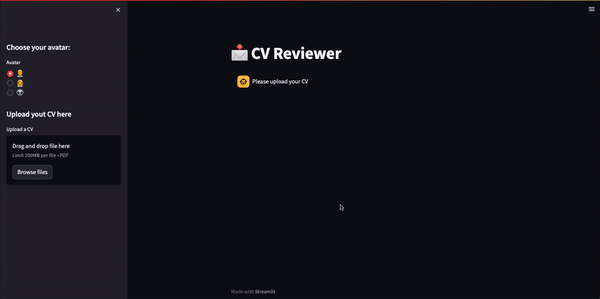
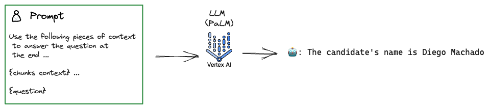

# Data ❤️ Chat: Chatea con tu Curriculum

[](https://github.com/diegulio/llm-cv-helper)

# Tópico: LLM - Chat ❤️ Data

En mi último post sobre LLM pudimos observar las capacidades que podemos aprovechar de los Large Language Models. Démos un vistazo a que aprendimos en el blog pasado:

- Introducción LLM
- OpenAI ChatGPT Model
- LangChain: Prompts, Chains
- Gradio

TLDR: En ese blog creamos una aplicación con una interfaz gráfica utilizando Gradio en donde se le permitía al usuario ingresar una comida y obtener tanto la receta como información de los ingredientes. Utilizamos los poderes de los modelos brindados por OpenAI 🤖 y orquestando todo con las facilidades que nos entrega Langchain 🦜⛓️.

Un punto importante es que la información utilizada provenía de internet con la cual fue entrenado el modelo de OpenAI. **Dicho esto, existirán muchas ocasiones en donde nos gustaría que nuestros modelos puedan consultar nuestra propia información!**

> [!NOTE]
> Algo importante a mencionar es que el hecho de integrar tu información a un LLM puede hacerse de diversas formas, tales como utilizando Fine-tuning o ingresando tu información como contexto. En este caso nos enfocaremos en la última. ¡Déjame saber si te interesaría que escribiera algún otro post sobre Fine-tuning!

# 📁 Motivación: Revisión de Currículum

En una de las empresas que trabajé solía entrevistar a los futuros practicantes y memoristas que se unirían al equipo. Lamentablemente mi memoria me suele fallar y a veces recordaba que tenía la entrevista unos minutos antes por lo que no alcanzaba a leer el curriculum del candidato. Entonces pensé: **¡qué entretenido seria tener un asistente que me ayudara a leer los curriculums de los candidatos!**

🧠 **Solución: Utilizar LLM para "chatear" con los CV entregados por los candidatos.**

# 👨🏾‍💻 Demo

A modo de motivación, te dejo un simple demo de lo que construiremos:



# 🔨 Tool Path: Que utilizaremos

1. **🌴 PaLM API**: LLM entrenado por Google AI
2. **🦜⛓️ LangChain**: Para comunicarme fácilmente con la API de PaLM
3. **🐍 Python**: Lenguaje de Programación
4. **👑 Streamlit**: Framework para crear interfaz de usuario

> [!NOTE]
> Notar un par de diferencias con el post anterior: ahora utilizaremos los poderes de los LLM brindados por Google AI, y aprovecharemos los nuevos componentes que nos entrega Streamlit para crear interfaces en base a chats.

# 💭 Concept Path: Que aprenderemos

1. **LLM**: Modelo de lenguaje
2. **Document Management**: Como procesamos documentos para un LLM
3. **Embeddings**: Como traducimos texto a algo entendible para un LLM
4. **Vector Stores**: Donde almacenamos los embeddings de los textos
5. **Retrievers**: De que forma le entregamos el documento a un LLM

# ♟️ Estrategia: Como abordamos

## Document As Context

Desde una vista general, los LLM utilizan la información de documentos como **contexto**. Imaginemos tenemos un documento de texto que contiene algo como:

> Diego tiene 25 años, es Ingeniero Civil Industrial, le gusta ver animé, jugar videojuegos, ir al gimnasio y jugar pádel.

Si usamos el LLM sin entregarle el documento, el modelo no sabrá quién es Diego. Pero si agregamos la información como **contexto** en el prompt:

> [!NOTE]
> **Prompt con contexto:**
> 
> Utiliza las siguientes piezas de contexto para responder la pregunta al final. Por favor si no sabes la respuesta, sólo di que no sabes, no intentes inventarla.
> 
> Diego tiene 25 años, es Ingeniero Civil Industrial...
> 
> Pregunta: ¿A diego le gusta hacer deporte?

Hasta ahora bastante sencillo, ¿cierto? Pero hay una limitante importante: el famoso `context_length` que nos restringe la cantidad de caracteres que podemos ingresar en el prompt.



## Data Connection

Cuando el documento es tan grande que sobrepasa el `context_length`, necesitamos una estrategia mejor que insertar texto aleatorio como contexto.

💡 Una mejor idea: **extraer partes del documento que se relacionen con la pregunta**:

1. **Load Documents**: Cargar los documentos
2. **Split Documents**: Dividir los documentos en piezas de texto
3. **Embedding**: Extraer features de las piezas de texto
4. **Vector Store**: Guardar features en una base de datos para utilizarlo después.


El objetivo es poder representar cada `chunk` de texto de forma semántica, para así poder hacer la relación con la pregunta del usuario, y decidir qué chunks incluir en el prompt final.

### 1. Load Documents

Langchain posee una gran variedad de métodos para cargar documentos. En nuestro caso, necesitamos tomar un CV en PDF y extraer su texto.

### 2. Split Documents

En general, los divisores de texto funcionan de la siguiente manera:

1. Dividir el texto en pequeños fragmentos semánticamente significativos (a menudo oraciones).
2. Comenzar a combinar estos pequeños fragmentos en un fragmento más grande hasta que alcance un cierto tamaño `chunk_size`.
3. Una vez que alcance ese tamaño, hace que ese fragmento sea su propio chunk y comienza a crear uno nuevo con algo de superposición `overlap_size` (para mantener el contexto entre los fragmentos).

### 3. Embeddings

Los Embeddings permiten representar palabras, caracteres, sentencias o documentos con **vectores**. Además podemos calcular medidas de similaridad entre estos utilizando operaciones vectoriales, como el producto punto o el coseno del ángulo entre vectores.

### 4. Vector Stores

Los Vector Stores son almacenamientos de embeddings. Podemos guardar cada palabra, sentencia, documento con su respectivo embedding para luego consultar esta base de datos eficientemente.


## Retrievers

Habíamos quedado con el problema de que documentos largos no caben en el contexto del prompt. Ahora que tenemos los chunks con sus embeddings, nuestra misión es:

**En base a una pregunta, obtener las piezas de texto más relevantes para incluirlas en el prompt final.**


> [!NOTE]
> La forma en la que se decide qué chunks son relevantes se denomina **retrievers**, y existen diversas metodologías muy interesantes y robustas. Te invito a buscar más información en la documentación de [Langchain](https://python.langchain.com/docs/modules/data_connection/retrievers/).

# 🧠 Prototyping: Code Time!

Revisitemos el proceso:

1. Load Document: Cargar Curriculum
2. Splitting: Dividir información en chunks
3. Vector Store: Almacenamos embeddings
4. Create Conversational Retrieval Chain: Crear el bot.

## 1. Load Document

```python
from langchain.document_loaders import PyPDFLoader

loader = PyPDFLoader("../docs/CV_DMV.pdf")
pages = loader.load()

# Metadata disponible:
pages[0].metadata  # {'source': '../docs/CV_DMV.pdf', 'page': 0}
```

## 2. Splitting documents

Utilizaremos el **Recursive Character Text Splitter**, recomendado para texto genérico:

```python
from langchain.text_splitter import RecursiveCharacterTextSplitter

text_splitter = RecursiveCharacterTextSplitter(
    chunk_size=1000,
    chunk_overlap=100,
)

texts = text_splitter.split_documents(pages)
```

## 3. Vector Store

```python
from langchain.vectorstores import Chroma
from langchain.embeddings import VertexAIEmbeddings

embeddings = VertexAIEmbeddings(project='gcp-project')
persist_directory = 'docs/chroma/'

vectordb = Chroma.from_documents(
    documents=texts,
    embedding=embeddings,
    persist_directory=persist_directory
)
vectordb.persist()
```

Podemos probar con una búsqueda de similaridad:

```python
question = "What is the name of the candidate?"
docs = vectordb.similarity_search(question, k=2)
print(docs[0].page_content[:300])
```

```
DIEGOMACHADO
/_4782ndAugust1997 /_475dmachadovz@gmail.com ...
BRIEFDESCRIPTION
Industrialengineeringgraduatedwitha master'sdegreeinengineeringsciences.
```

¡El nombre del candidato aparece en el documento más similar a la query! 😎

## 4. Conversational Retrieval Chain

```python
from langchain.memory import ConversationBufferMemory
from langchain.chains import ConversationalRetrievalChain
from langchain.llms import VertexAI

memory = ConversationBufferMemory(
    memory_key="chat_history",
    return_messages=True
)

llm = VertexAI(project_id='gcp-project')
retriever = vectordb.as_retriever()

qa = ConversationalRetrievalChain.from_llm(
    llm,
    retriever=retriever,
    memory=memory
)
```

Probándolo en acción:

```python
question = "Does the candidate has been teacher assistant?"
result = qa({"question": question})
# answer: 'Yes, the candidate has been a teacher assistant.'

question = "In which universities?"
result = qa({"question": question})
# answer: 'The candidate has been a teacher assistant at Universidad de Santiago and Universidad Adolfo Ibañez.'
```

¡El bot recuerda las preguntas anteriores gracias a la memoria! 🤖

# 🧐 Front-End

Utilizamos los nuevos componentes de Streamlit para chat:

```python
# Input de usuario
prompt = st.chat_input("Ask something")

# Respuesta del asistente
with st.chat_message("user", avatar=user_avatar):
    st.write(message.content)
```


Para ver el código completo visita el [repositorio](https://github.com/diegulio/llm-cv-helper).

# 🚀 Próximos Pasos

- Verificar que lo que se suba sea un CV
- Aceptar más tipos de documentos
- Probar más tipos de Retrievers
- Probar más tipos de Documents Chains
- Aceptar múltiples CVs y poder comparar

# 🥳 Conclusión

En este blog exploramos cómo aprovechar los Large Language Models para crear una aplicación de chat que interactúa con documentos. Utilizamos el modelo PaLM de VertexAI junto con LangChain para orquestar toda la funcionalidad.

Aprendimos sobre embeddings para representar texto numéricamente, Vector Stores para almacenar y recuperar eficientemente estos embeddings, y cómo resolver el problema de documentos largos usando técnicas de división y retrievers.

¡Esta exploración es solo el comienzo — el potencial de los LLMs junto con herramientas como LangChain es enorme!
