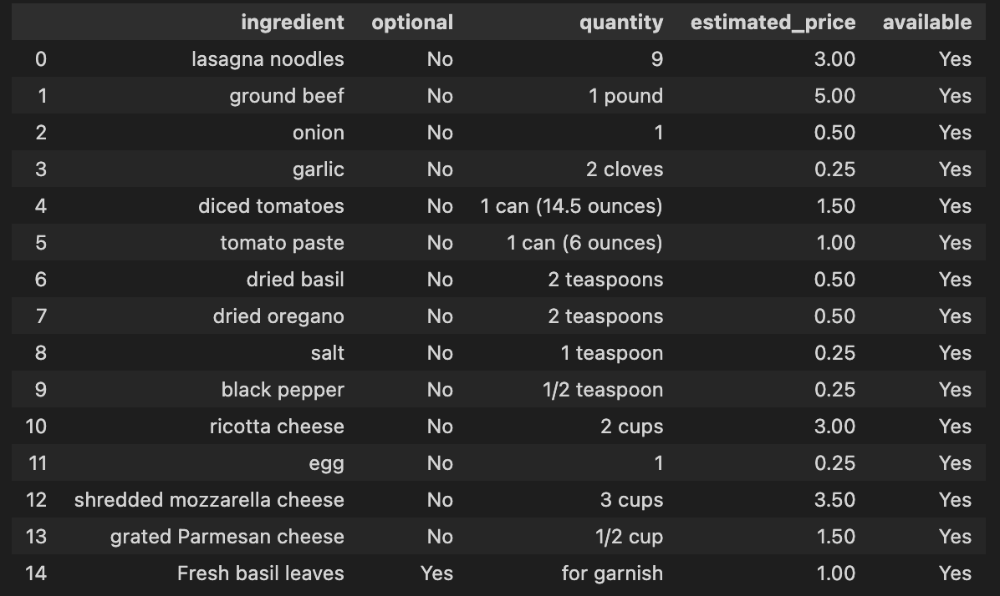

# Iniciando en LLM: Crea tu primera aplicación con LangChain y ChatGPT

[](https://github.com/diegulio/llm-recipe)

> [!NOTE]
> Antes de comenzar a leer esto, recuerda que yo estoy aprendiendo junto contigo. Si tienes alguna duda, sugerencia, corrección o comentario, no dudes en escribirme a mi [LinkedIn](https://www.linkedin.com/in/dieguliomachado/).

# 📚 Tópico: Large Language Models

Estoy seguro que alguna vez has escuchado el término ChatGPT. ¡Ese robot 🤖 que te hace hasta la tesis! ChatGPT es un LLM (Large Language Model), lo que significa que es un modelo matemático que se alimenta de grandes volúmenes de texto y es capaz de generar lenguaje humano de manera **muy** avanzada.

¿Qué tal si dejamos que un LLM nos describa qué es un LLM?

> [!NOTE]
> **🤖 ChatGPT dice:**
> 
> Un large language model es un tipo de sistema de inteligencia artificial diseñado para comprender y generar lenguaje humano de manera avanzada. Estos modelos están entrenados en grandes cantidades de texto y utilizan técnicas de aprendizaje automático para aprender patrones y estructuras lingüísticas. Un large language model, como GPT-3.5, puede responder preguntas, redactar textos, generar código, traducir idiomas y realizar una variedad de tareas relacionadas con el lenguaje natural.

En este post **no** hablaremos de las técnicas utilizadas para construir un LLM. Lo que haremos será utilizar los LLM en el bien de la humanidad! 🦸🏽‍♀️

# 🛒 Motivación: De compras con LLM

El otro dia quería cocinar lasagna, pero no sabía si tenía los ingredientes en casa. Me metí a la website de mi supermercado favorito para comprar los ingredientes, pero nunca he cocinado lasagna y no sé qué ingredientes lleva. Me dió tanta flojera googlear una receta, extraer los ingredientes y ponerlos uno por uno en el carrito de compras, que terminé comiendo cereales con leche 🥣.

Ahí fue cuando pensé que sería bueno que el supermercado tuviese integrado un algoritmo que agregue automáticamente los ingredientes de una comida específica en el carrito de compras 🛍️.

🧠 **Solución: Utilizar LLM para obtener recetas y extraer los ingredientes de forma estructurada.**

# 🔨 Tool Path: Que utilizaremos

1. **ChatGPT API**: Para poder acceder a los poderes de ChatGPT
2. **LangChain**: Para poder comunicarme de manera fácil con la API de ChatGPT
3. **Python**: Lenguaje de programación
4. **Gradio**: Para crear una interfaz simple de uso

# 💭 Concept Path: Que aprenderemos

1. LLM: Ya hablamos un poco sobre esto
2. Prompt Engineering
3. Prompt Templates
4. Chains
5. Environments
6. Framework

# ♟️ Estrategia: Como abordamos

La solución es bastante directa: pedirle a algún LLM que nos entregue los ingredientes de una comida específica.

## Prompt Engineering

Imaginemos queremos saber los ingredientes para cocinar una lasagna. Escribiremos algo del estilo:

> [!NOTE]
> **👩🏼‍🔬 Usuario:** ¿Que necesito para cocinar una Lasagna?

Esta pregunta, que es la entrada de un LLM, se le denomina `prompt`. Un `prompt` mal formulado puede obtener resultados inesperados:

> [!NOTE]
> **🤖 LLM:** Para cocinar una lasagna necesitas un horno, un cuchillo, una cocina y los ingredientes.

¡No es la respuesta que esperábamos! Una versión mejorada:

> [!NOTE]
> **👩🏼‍🔬 Usuario:** ¿Cuales son los **ingredientes** que necesito para cocinar una lasagna?

## Output esperado

Decidí obtener el resultado como JSON con los siguientes elementos:

- **Ingredient**: Nombre del ingrediente
- **Quantity**: Cantidad necesaria
- **Optional**: "Yes" si el ingrediente es opcional, "No" si es obligatorio
- **Estimated Price**: Un precio estimado en dólares
- **Available**: Simulación de disponibilidad en el supermercado

```json
{
  "Spaguetthi With Meat": [
    {
      "ingredient": "Spaguetti",
      "optional": "No",
      "quantity": "200g",
      "estimated_price": "5.00",
      "available": "No"
    },
    {
      "ingredient": "Meat",
      "optional": "No",
      "quantity": "1kg",
      "estimated_price": "10.00",
      "available": "Yes"
    }
  ]
}
```

# 🧠 Prototyping

La forma final de la solución será:

1. Usar un LLM para obtener la receta según la comida
2. Usar un LLM para obtener los ingredientes de la receta obtenida
3. Crear la cadena final de LLM (unir los pasos 1 y 2)
4. Parsear los resultados (estructurarlos)

> [!NOTE]
> Inicialmente había pensado en que un LLM directamente me entregue los ingredientes desde una comida especificada, pero luego de unas cuantas iteraciones llegué a que la forma basada en chains conseguía mejores resultados.

## 1. Obtener receta mediante LLM

### Prompt Templates

La idea es que el usuario **sólo ingrese el nombre de la comida**, y nuestra aplicación haga el resto. Para esto, Langchain cuenta con **Prompt Templates**:

```python
from langchain.prompts import (
    ChatPromptTemplate,
    SystemMessagePromptTemplate,
    HumanMessagePromptTemplate,
)

# System template
first_system_template_str = """
    You are a good chef, users need you to bring them recipes from given food.
"""
first_system_template = SystemMessagePromptTemplate.from_template(first_system_template_str)

# Human Template
first_human_template_str = "{food}"
first_human_template = HumanMessagePromptTemplate.from_template(first_human_template_str)

# First Prompt Template
first_prompt = ChatPromptTemplate.from_messages([first_system_template, first_human_template])
```

### LLM Model

Para usar ChatGPT necesitas una API Key de [OpenAI](https://openai.com/blog/openai-api). Crea un archivo `.env` en la raíz del proyecto:

```bash
OPENAI_API_KEY = "<tu api key>"
```

> [!WARNING]
> ¡No debes dejar que nadie vea tu API KEY! No subas tu `.env` a ningún lugar público.

```python
from langchain.chains import LLMChain
from langchain.chat_models import ChatOpenAI

llm = ChatOpenAI(temperature=0)
recipe_chain = LLMChain(llm=llm, prompt=first_prompt, output_key="recipe")
```

## 2. Obtener ingredientes de la receta

Aplicaremos **Prompt Engineering** para que el LLM nos entregue el output en formato JSON:

```python
second_step_template = """I need you to bring me the ingredients contained in the following recipe:
recipe: {recipe}
{format_instructions}
{example_instructions}"""

custom_format_instructions = """
The output should be in a json format, formatted in the following schema:
{
  "food": [
    {
      "ingredient": string,
      "quantity": string,
      "optional": string,  // "Yes" or "No"
      "estimated_price": string,
      "available": string  // Random "Yes" or "No"
    }
  ]
}
"""

second_prompt = ChatPromptTemplate.from_template(second_step_template)
ingredient_chain = LLMChain(llm=llm, prompt=second_prompt, output_key="ingredients")
```

> [!WARNING]
> Langchain cuenta con un módulo de Output Parser que crea por detrás el `format_instructions`. La razón de porqué no lo ocupé fue que no funciona para JSONs anidados. Me basé en sus instrucciones para crear `custom_format_instructions`.

## 3. Cadena Final

```python
overall_simple_chain = SequentialChain(
    chains=[recipe_chain, ingredient_chain],
    verbose=True,
    input_variables=["food", "format_instructions", "example_instructions"],
    output_variables=["recipe", "ingredients"]
)
```

## 4. Output Parser

```python
import json
import pandas as pd

result = overall_simple_chain({
    "food": food,
    "format_instructions": custom_format_instructions,
    "example_instructions": example_instructions,
})

dict_response = json.loads(result['ingredients'])
output_df = pd.DataFrame(data=dict_response['food'])
```

Para la entrada "Lasagna", obtenemos algo así:



# 🧐 Front-End

Nuestra aplicación no puede quedarse sólo en código. Creamos un pequeño front-end usando **Gradio**:


El botón "Avisar" de Gradio sirve para recibir feedback de los usuarios en caso de que el resultado no haya sido satisfactorio.

# 🚀 Próximos Pasos

- **Prompt Optimization**: Mejorar los prompts para detectar si el usuario ingresa algo que no es una comida.
- **Fine-Tuning**: Podríamos entrenar un LLM con datos de recetarios.
- **Document**: Hacer que el LLM considere un libro de recetas particular a la hora de crear su respuesta.

# 🥳 Conclusión

En este blog exploramos el mundo de los Large Language Models y su aplicación en la vida cotidiana. Descubrimos cómo utilizar los LLM para obtener recetas y extraer los ingredientes de forma estructurada, usando técnicas de **Prompt Engineering**.

Mediante el uso de herramientas como LangChain, Python y Gradio, pudimos construir una solución que permite al usuario ingresar el nombre de una comida y obtener automáticamente los ingredientes necesarios para cocinarla.

¡Recuerda que en GitHub podrás encontrar el código utilizado en este proyecto!
