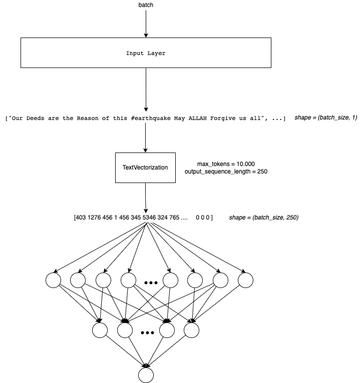
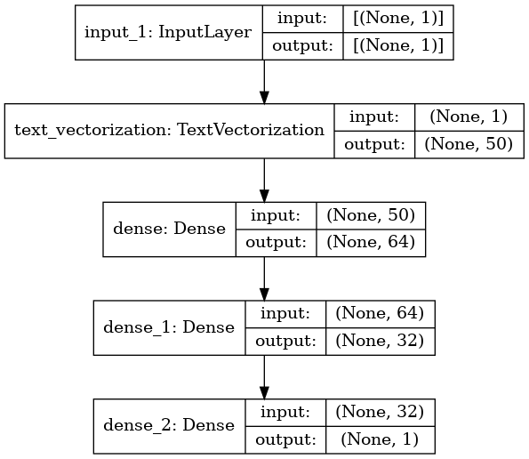

# Simple NN
In this notebook I will use a simple Neural Network Arquitecture. We need to remember that we only can feed numbers to NN !

The Arquitecture will look like this:



Remember that is belong to a NLP Notebook series where I am learning and testing different NLP approachs in this competition. Like NN, Embedding, RNN, Transformers, HuggingFace, etc.

To see the other notebooks visit: https://www.kaggle.com/code/diegomachado/seqclass-nn-embed-rnn-lstm-gru-bert-hf

## Libraries

```python
import pandas as pd
import numpy as np

import seaborn as sns
import matplotlib.pyplot as plt
import gc

import tensorflow as tf
from tensorflow.keras.layers import TextVectorization, Lambda
from tensorflow.keras import layers
from tensorflow.keras.utils import plot_model
from tensorflow.keras.preprocessing.text import text_to_word_sequence
from tensorflow.keras import losses
from tensorflow.keras.callbacks import EarlyStopping, TensorBoard, ReduceLROnPlateau
#import tensorflow_hub as hub
#import tensorflow_text as text # Bert preprocess uses this 
from tensorflow.keras.optimizers import Adam

import re
import nltk
from nltk.corpus import stopwords
import string
from gensim.models import KeyedVectors

#nltk.download('stopwords')
```

## Data

```python
# Load data
train = pd.read_csv("/kaggle/input/df-split/df_split/df_train.csv")
test = pd.read_csv("/kaggle/input/df-split/df_split/df_test.csv")

X_train = train[[col for col in train.columns if col != 'target']].copy()
y_train = train['target'].copy()

X_test = test[[col for col in test.columns if col != 'target']].copy()
y_test = test['target'].copy()
```

```python
# Tensorflow Datasets
train_ds = tf.data.Dataset.from_tensor_slices((X_train.text, y_train))
test_ds = tf.data.Dataset.from_tensor_slices((X_test.text, y_test))
train_ds
```

```text
2022-12-11 14:55:06.219408: I tensorflow/core/common_runtime/process_util.cc:146] Creating new thread pool with default inter op setting: 2. Tune using inter_op_parallelism_threads for best performance.
```

```text
<TensorSliceDataset shapes: ((), ()), types: (tf.string, tf.int64)>
```

Instantiate [TextVectorization Layer](https://www.tensorflow.org/api_docs/python/tf/keras/layers/TextVectorization)

```python
max_features = 10000 # Vocabulary (TensorFlow select the most frequent tokens)
sequence_length = 50 # It will pad or truncate sequences
vectorization_layer = TextVectorization(
    max_tokens = max_features,
    output_sequence_length = sequence_length,
)

# Adapt is to compute metrics (In this case the vocabulary)
vectorization_layer.adapt(X_train.text)
```

```text
2022-12-11 14:55:06.451771: I tensorflow/compiler/mlir/mlir_graph_optimization_pass.cc:185] None of the MLIR Optimization Passes are enabled (registered 2)
```

```python
# Testing the Vectorization layer
def vectorize_text(text):
    text = tf.expand_dims(text, -1)
    return vectorization_layer(text)

# retrieve a batch (of 1 review and label) from the dataset
text_batch, label_batch = next(iter(train_ds))
first_review, first_label = text_batch, label_batch
print("Review", first_review)
print("Label", first_label)
print("Vectorized review", vectorize_text(first_review))
```

```text
Review tf.Tensor(b'Riot Kit Bah - part of the new concept Gear coming for Autumn/Winter\n#menswear #fashion #urbanfashion\xc2\x89\xc3\x9b_ https://t.co/cCwzDTFbUS', shape=(), dtype=string)
Label tf.Tensor(0, shape=(), dtype=int64)
Vectorized review tf.Tensor(
[[ 403 1278    1  572    6    2   44 3700    1  250   10    1    1  968
  6559    1    0    0    0    0    0    0    0    0    0    0    0    0
     0    0    0    0    0    0    0    0    0    0    0    0    0    0
     0    0    0    0    0    0    0    0]], shape=(1, 50), dtype=int64)
```

**🔍** We see that the length of the vector is `output_sequence_length = 250`, and if the statement is not that long, it is paded with 0. We also note that no integer is greater than 10000, since we set this as our maximum vocabulary of tokens (vocabulary_size()). We also see that there are some integers = 1. This in the vocabulary corresponds to `UNK`, that is, unknown words (tokens), this is because our vocabulary is limited (TextVectorization chooses the 10000 most frequent ones).

An improvement can be to analyze the length of the dataset sentences and choose an output_sequence_lenght based on this (to avoid to much pad)

```python
vectorization_layer.vocabulary_size()
```

```text
10000
```

```python
# To see the vocabulary
vectorization_layer.get_vocabulary()[:10]
```

```text
['', '[UNK]', 'the', 'a', 'in', 'to', 'of', 'and', 'i', 'is']
```

### Data Pipeline

Now we need to prepare the data pipeline:

batch -> cache -> prefetch

- `Batch` : Create a set of samples (Those will be processed together in the model)
- `Cache`: The first time the dataset is iterated over, its elements will be cached either in the specified file or in memory. Subsequent iterations will use the cached data.
- `Prefetch` : This allows later elements to be prepared while the current element is being processed. This often improves latency and throughput, at the cost of using additional memory to store prefetched elements.

Optional: You can do it another steps like `shuffle`

```python
AUTOTUNE = tf.data.AUTOTUNE
train_ds = train_ds.batch(32).cache().prefetch(buffer_size=AUTOTUNE)
test_ds = test_ds.batch(32).cache().prefetch(buffer_size=AUTOTUNE)
```

### Model 

We will build a simple Sequential Model composed by two Dense Layers. I dont take to much time tunning it.

```python
model = tf.keras.Sequential([
    layers.Input(shape=(1,), dtype=tf.string), # Input Layer
    vectorization_layer, # Vectorization Layer
    layers.Dense(64),
    #layers.Dropout(0.1),
    layers.Dense(32),
    #layers.Dropout(0.1),
    layers.Dense(1)
])
```

```python
model.summary()
```

```text
Model: "sequential"
_________________________________________________________________
Layer (type)                 Output Shape              Param #
=================================================================
text_vectorization (TextVect (None, 50)                0
_________________________________________________________________
dense (Dense)                (None, 64)                3264
_________________________________________________________________
dense_1 (Dense)              (None, 32)                2080
_________________________________________________________________
dense_2 (Dense)              (None, 1)                 33
=================================================================
Total params: 5,377
Trainable params: 5,377
Non-trainable params: 0
_________________________________________________________________
```

```python
plot_model(model, show_shapes=True)
```



```python
model.compile(loss=losses.BinaryCrossentropy(from_logits=True),
              optimizer='adam',
              metrics=tf.metrics.BinaryAccuracy(threshold=0.5))
```

🔍 **Due to our last Dense Layer has a linear activation function, it computes the logits. So the loss function needs to be computed with `from_logits=True`.**

```python
epochs = 100
history = model.fit(
    train_ds,
    validation_data = test_ds,
    epochs=epochs)
```

```text
Epoch 1/100
191/191 [==============================] - 2s 4ms/step - loss: 76.1297 - binary_accuracy: 0.5123 - val_loss: 30.4719 - val_binary_accuracy: 0.5207
Epoch 2/100
191/191 [==============================] - 1s 3ms/step - loss: 37.2703 - binary_accuracy: 0.5167 - val_loss: 22.0519 - val_binary_accuracy: 0.5194
Epoch 3/100
191/191 [==============================] - 1s 3ms/step - loss: 34.7663 - binary_accuracy: 0.5118 - val_loss: 27.2791 - val_binary_accuracy: 0.5141
Epoch 4/100
191/191 [==============================] - 1s 3ms/step - loss: 28.8605 - binary_accuracy: 0.5135 - val_loss: 26.1287 - val_binary_accuracy: 0.5253
Epoch 5/100
191/191 [==============================] - 1s 3ms/step - loss: 28.4162 - binary_accuracy: 0.5123 - val_loss: 24.3497 - val_binary_accuracy: 0.5108
Epoch 6/100
191/191 [==============================] - 1s 3ms/step - loss: 26.5699 - binary_accuracy: 0.5084 - val_loss: 17.0479 - val_binary_accuracy: 0.5148
Epoch 7/100
191/191 [==============================] - 1s 3ms/step - loss: 24.1579 - binary_accuracy: 0.5136 - val_loss: 24.3595 - val_binary_accuracy: 0.5351
Epoch 8/100
191/191 [==============================] - 1s 3ms/step - loss: 22.3645 - binary_accuracy: 0.5110 - val_loss: 18.3034 - val_binary_accuracy: 0.5108
Epoch 9/100
191/191 [==============================] - 1s 3ms/step - loss: 19.4826 - binary_accuracy: 0.5059 - val_loss: 17.5856 - val_binary_accuracy: 0.5161
Epoch 10/100
191/191 [==============================] - 1s 3ms/step - loss: 19.1403 - binary_accuracy: 0.5156 - val_loss: 15.4736 - val_binary_accuracy: 0.5299
Epoch 11/100
191/191 [==============================] - 1s 3ms/step - loss: 16.6029 - binary_accuracy: 0.5156 - val_loss: 13.5105 - val_binary_accuracy: 0.5220
Epoch 12/100
191/191 [==============================] - 0s 3ms/step - loss: 16.8898 - binary_accuracy: 0.5166 - val_loss: 13.1816 - val_binary_accuracy: 0.5253
Epoch 13/100
191/191 [==============================] - 1s 3ms/step - loss: 15.9538 - binary_accuracy: 0.5151 - val_loss: 14.4587 - val_binary_accuracy: 0.5391
Epoch 14/100
191/191 [==============================] - 1s 3ms/step - loss: 15.0781 - binary_accuracy: 0.5085 - val_loss: 11.7277 - val_binary_accuracy: 0.5312
Epoch 15/100
191/191 [==============================] - 1s 3ms/step - loss: 13.2963 - binary_accuracy: 0.5072 - val_loss: 8.4516 - val_binary_accuracy: 0.5167
Epoch 16/100
191/191 [==============================] - 1s 3ms/step - loss: 11.8151 - binary_accuracy: 0.5125 - val_loss: 13.2906 - val_binary_accuracy: 0.5351
Epoch 17/100
191/191 [==============================] - 1s 3ms/step - loss: 12.2239 - binary_accuracy: 0.5136 - val_loss: 10.8708 - val_binary_accuracy: 0.5378
Epoch 18/100
191/191 [==============================] - 1s 3ms/step - loss: 11.7989 - binary_accuracy: 0.5046 - val_loss: 8.7974 - val_binary_accuracy: 0.5299
Epoch 19/100
191/191 [==============================] - 1s 3ms/step - loss: 10.5223 - binary_accuracy: 0.5103 - val_loss: 9.4426 - val_binary_accuracy: 0.5253
Epoch 20/100
191/191 [==============================] - 1s 3ms/step - loss: 10.5585 - binary_accuracy: 0.5122 - val_loss: 9.8687 - val_binary_accuracy: 0.5246
Epoch 21/100
191/191 [==============================] - 1s 3ms/step - loss: 9.2616 - binary_accuracy: 0.5167 - val_loss: 11.9928 - val_binary_accuracy: 0.5253
Epoch 22/100
191/191 [==============================] - 1s 3ms/step - loss: 10.1322 - binary_accuracy: 0.5213 - val_loss: 7.8273 - val_binary_accuracy: 0.4990
Epoch 23/100
191/191 [==============================] - 1s 3ms/step - loss: 8.4561 - binary_accuracy: 0.5200 - val_loss: 9.2781 - val_binary_accuracy: 0.5174
Epoch 24/100
191/191 [==============================] - 1s 3ms/step - loss: 8.0963 - binary_accuracy: 0.5166 - val_loss: 5.4576 - val_binary_accuracy: 0.5167
Epoch 25/100
191/191 [==============================] - 1s 3ms/step - loss: 7.1907 - binary_accuracy: 0.5122 - val_loss: 8.8754 - val_binary_accuracy: 0.5003
Epoch 26/100
191/191 [==============================] - 1s 3ms/step - loss: 6.9971 - binary_accuracy: 0.5190 - val_loss: 7.2822 - val_binary_accuracy: 0.5095
Epoch 27/100
191/191 [==============================] - 1s 3ms/step - loss: 6.5726 - binary_accuracy: 0.5105 - val_loss: 5.3474 - val_binary_accuracy: 0.4879
Epoch 28/100
191/191 [==============================] - 1s 3ms/step - loss: 6.0869 - binary_accuracy: 0.5243 - val_loss: 5.1194 - val_binary_accuracy: 0.5174
Epoch 29/100
191/191 [==============================] - 1s 3ms/step - loss: 5.7851 - binary_accuracy: 0.5125 - val_loss: 6.9937 - val_binary_accuracy: 0.5076
Epoch 30/100
191/191 [==============================] - 1s 3ms/step - loss: 5.1723 - binary_accuracy: 0.5148 - val_loss: 5.7589 - val_binary_accuracy: 0.5062
Epoch 31/100
191/191 [==============================] - 1s 4ms/step - loss: 5.1466 - binary_accuracy: 0.5125 - val_loss: 3.9673 - val_binary_accuracy: 0.5181
Epoch 32/100
191/191 [==============================] - 1s 3ms/step - loss: 4.2948 - binary_accuracy: 0.5186 - val_loss: 5.4504 - val_binary_accuracy: 0.5089
Epoch 33/100
191/191 [==============================] - 1s 3ms/step - loss: 4.4029 - binary_accuracy: 0.5095 - val_loss: 2.8821 - val_binary_accuracy: 0.5128
Epoch 34/100
191/191 [==============================] - 1s 3ms/step - loss: 4.0808 - binary_accuracy: 0.5099 - val_loss: 3.8832 - val_binary_accuracy: 0.5161
Epoch 35/100
191/191 [==============================] - 1s 3ms/step - loss: 3.7501 - binary_accuracy: 0.5174 - val_loss: 3.9605 - val_binary_accuracy: 0.5135
Epoch 36/100
191/191 [==============================] - 1s 3ms/step - loss: 3.7382 - binary_accuracy: 0.5102 - val_loss: 3.6448 - val_binary_accuracy: 0.5115
Epoch 37/100
191/191 [==============================] - 1s 3ms/step - loss: 3.1055 - binary_accuracy: 0.5245 - val_loss: 3.9398 - val_binary_accuracy: 0.5056
Epoch 38/100
191/191 [==============================] - 1s 3ms/step - loss: 2.9880 - binary_accuracy: 0.5151 - val_loss: 2.8102 - val_binary_accuracy: 0.5082
Epoch 39/100
191/191 [==============================] - 1s 3ms/step - loss: 2.7847 - binary_accuracy: 0.5215 - val_loss: 2.1289 - val_binary_accuracy: 0.5187
Epoch 40/100
191/191 [==============================] - 1s 3ms/step - loss: 2.8415 - binary_accuracy: 0.5241 - val_loss: 2.8795 - val_binary_accuracy: 0.5115
Epoch 41/100
191/191 [==============================] - 1s 3ms/step - loss: 2.5144 - binary_accuracy: 0.5223 - val_loss: 2.5149 - val_binary_accuracy: 0.5213
Epoch 42/100
191/191 [==============================] - 1s 3ms/step - loss: 2.0964 - binary_accuracy: 0.5287 - val_loss: 2.0305 - val_binary_accuracy: 0.5207
Epoch 43/100
191/191 [==============================] - 1s 3ms/step - loss: 2.1527 - binary_accuracy: 0.5158 - val_loss: 1.8447 - val_binary_accuracy: 0.5095
Epoch 44/100
191/191 [==============================] - 1s 3ms/step - loss: 2.0041 - binary_accuracy: 0.5296 - val_loss: 1.7671 - val_binary_accuracy: 0.5095
Epoch 45/100
191/191 [==============================] - 1s 3ms/step - loss: 1.7718 - binary_accuracy: 0.5232 - val_loss: 2.0167 - val_binary_accuracy: 0.5121
Epoch 46/100
191/191 [==============================] - 1s 3ms/step - loss: 1.8157 - binary_accuracy: 0.5159 - val_loss: 1.7764 - val_binary_accuracy: 0.5227
Epoch 47/100
191/191 [==============================] - 1s 3ms/step - loss: 1.6907 - binary_accuracy: 0.5281 - val_loss: 1.3804 - val_binary_accuracy: 0.5233
Epoch 48/100
191/191 [==============================] - 1s 3ms/step - loss: 1.5388 - binary_accuracy: 0.5233 - val_loss: 1.4022 - val_binary_accuracy: 0.5213
Epoch 49/100
191/191 [==============================] - 1s 3ms/step - loss: 1.6031 - binary_accuracy: 0.5259 - val_loss: 1.3513 - val_binary_accuracy: 0.5253
Epoch 50/100
191/191 [==============================] - 1s 3ms/step - loss: 1.3865 - binary_accuracy: 0.5271 - val_loss: 1.1486 - val_binary_accuracy: 0.5246
Epoch 51/100
191/191 [==============================] - 1s 3ms/step - loss: 1.2101 - binary_accuracy: 0.5269 - val_loss: 1.0696 - val_binary_accuracy: 0.5227
Epoch 52/100
191/191 [==============================] - 1s 3ms/step - loss: 1.2028 - binary_accuracy: 0.5368 - val_loss: 1.1062 - val_binary_accuracy: 0.5292
Epoch 53/100
191/191 [==============================] - 1s 3ms/step - loss: 1.1968 - binary_accuracy: 0.5332 - val_loss: 0.9421 - val_binary_accuracy: 0.5318
Epoch 54/100
191/191 [==============================] - 1s 3ms/step - loss: 1.1506 - binary_accuracy: 0.5340 - val_loss: 1.0106 - val_binary_accuracy: 0.5338
Epoch 55/100
191/191 [==============================] - 1s 3ms/step - loss: 1.2173 - binary_accuracy: 0.5281 - val_loss: 0.9825 - val_binary_accuracy: 0.5378
Epoch 56/100
191/191 [==============================] - 1s 3ms/step - loss: 1.1079 - binary_accuracy: 0.5296 - val_loss: 0.8303 - val_binary_accuracy: 0.5515
Epoch 57/100
191/191 [==============================] - 1s 3ms/step - loss: 0.9980 - binary_accuracy: 0.5378 - val_loss: 0.8406 - val_binary_accuracy: 0.5456
Epoch 58/100
191/191 [==============================] - 1s 3ms/step - loss: 1.1121 - binary_accuracy: 0.5363 - val_loss: 1.8118 - val_binary_accuracy: 0.5548
Epoch 59/100
191/191 [==============================] - 1s 3ms/step - loss: 1.0127 - binary_accuracy: 0.5388 - val_loss: 0.9639 - val_binary_accuracy: 0.5483
Epoch 60/100
191/191 [==============================] - 1s 3ms/step - loss: 0.9924 - binary_accuracy: 0.5374 - val_loss: 0.8626 - val_binary_accuracy: 0.5483
Epoch 61/100
191/191 [==============================] - 1s 3ms/step - loss: 0.8680 - binary_accuracy: 0.5399 - val_loss: 0.8083 - val_binary_accuracy: 0.5542
Epoch 62/100
191/191 [==============================] - 1s 3ms/step - loss: 0.8643 - binary_accuracy: 0.5440 - val_loss: 1.2377 - val_binary_accuracy: 0.5581
Epoch 63/100
191/191 [==============================] - 1s 3ms/step - loss: 0.9144 - binary_accuracy: 0.5396 - val_loss: 0.7873 - val_binary_accuracy: 0.5522
Epoch 64/100
191/191 [==============================] - 0s 3ms/step - loss: 0.9946 - binary_accuracy: 0.5343 - val_loss: 0.8474 - val_binary_accuracy: 0.5463
Epoch 65/100
191/191 [==============================] - 1s 3ms/step - loss: 0.9548 - binary_accuracy: 0.5365 - val_loss: 0.7671 - val_binary_accuracy: 0.5568
Epoch 66/100
191/191 [==============================] - 1s 3ms/step - loss: 0.9172 - binary_accuracy: 0.5432 - val_loss: 1.1670 - val_binary_accuracy: 0.5535
Epoch 67/100
191/191 [==============================] - 1s 3ms/step - loss: 0.9938 - binary_accuracy: 0.5473 - val_loss: 1.7050 - val_binary_accuracy: 0.5575
Epoch 68/100
191/191 [==============================] - 1s 3ms/step - loss: 0.8954 - binary_accuracy: 0.5394 - val_loss: 0.7633 - val_binary_accuracy: 0.5483
Epoch 69/100
191/191 [==============================] - 1s 3ms/step - loss: 0.8815 - binary_accuracy: 0.5460 - val_loss: 0.9965 - val_binary_accuracy: 0.5561
Epoch 70/100
191/191 [==============================] - 1s 3ms/step - loss: 0.8643 - binary_accuracy: 0.5438 - val_loss: 1.0431 - val_binary_accuracy: 0.5509
Epoch 71/100
191/191 [==============================] - 1s 3ms/step - loss: 0.8825 - binary_accuracy: 0.5483 - val_loss: 1.0019 - val_binary_accuracy: 0.5601
Epoch 72/100
191/191 [==============================] - 1s 3ms/step - loss: 0.9897 - binary_accuracy: 0.5479 - val_loss: 1.3509 - val_binary_accuracy: 0.5502
Epoch 73/100
191/191 [==============================] - 1s 3ms/step - loss: 0.9775 - binary_accuracy: 0.5427 - val_loss: 0.9652 - val_binary_accuracy: 0.5581
Epoch 74/100
191/191 [==============================] - 1s 3ms/step - loss: 1.0205 - binary_accuracy: 0.5445 - val_loss: 1.2212 - val_binary_accuracy: 0.5614
Epoch 75/100
191/191 [==============================] - 1s 3ms/step - loss: 1.0616 - binary_accuracy: 0.5432 - val_loss: 1.1886 - val_binary_accuracy: 0.5575
Epoch 76/100
191/191 [==============================] - 1s 3ms/step - loss: 0.9314 - binary_accuracy: 0.5468 - val_loss: 1.3687 - val_binary_accuracy: 0.5548
Epoch 77/100
191/191 [==============================] - 1s 3ms/step - loss: 0.8521 - binary_accuracy: 0.5470 - val_loss: 0.7695 - val_binary_accuracy: 0.5548
Epoch 78/100
191/191 [==============================] - 1s 3ms/step - loss: 0.8151 - binary_accuracy: 0.5517 - val_loss: 0.9690 - val_binary_accuracy: 0.5509
Epoch 79/100
191/191 [==============================] - 1s 3ms/step - loss: 0.9553 - binary_accuracy: 0.5453 - val_loss: 0.8552 - val_binary_accuracy: 0.5575
Epoch 80/100
191/191 [==============================] - 1s 3ms/step - loss: 0.8296 - binary_accuracy: 0.5512 - val_loss: 0.7398 - val_binary_accuracy: 0.5555
Epoch 81/100
191/191 [==============================] - 1s 3ms/step - loss: 0.8471 - binary_accuracy: 0.5548 - val_loss: 0.7572 - val_binary_accuracy: 0.5529
Epoch 82/100
191/191 [==============================] - 1s 3ms/step - loss: 0.8430 - binary_accuracy: 0.5456 - val_loss: 0.7894 - val_binary_accuracy: 0.5575
Epoch 83/100
191/191 [==============================] - 1s 3ms/step - loss: 0.8508 - binary_accuracy: 0.5471 - val_loss: 0.9579 - val_binary_accuracy: 0.5476
Epoch 84/100
191/191 [==============================] - 1s 3ms/step - loss: 0.8445 - binary_accuracy: 0.5537 - val_loss: 0.8346 - val_binary_accuracy: 0.5581
Epoch 85/100
191/191 [==============================] - 1s 4ms/step - loss: 0.8542 - binary_accuracy: 0.5511 - val_loss: 0.7923 - val_binary_accuracy: 0.5542
Epoch 86/100
191/191 [==============================] - 1s 3ms/step - loss: 0.9084 - binary_accuracy: 0.5481 - val_loss: 0.9421 - val_binary_accuracy: 0.5575
Epoch 87/100
191/191 [==============================] - 1s 3ms/step - loss: 0.9367 - binary_accuracy: 0.5463 - val_loss: 0.9959 - val_binary_accuracy: 0.5450
Epoch 88/100
191/191 [==============================] - 1s 3ms/step - loss: 0.9629 - binary_accuracy: 0.5498 - val_loss: 1.1058 - val_binary_accuracy: 0.5607
Epoch 89/100
191/191 [==============================] - 1s 3ms/step - loss: 0.9141 - binary_accuracy: 0.5365 - val_loss: 0.7433 - val_binary_accuracy: 0.5561
Epoch 90/100
191/191 [==============================] - 1s 3ms/step - loss: 0.8145 - binary_accuracy: 0.5478 - val_loss: 0.7720 - val_binary_accuracy: 0.5529
Epoch 91/100
191/191 [==============================] - 1s 3ms/step - loss: 0.7985 - binary_accuracy: 0.5560 - val_loss: 0.7784 - val_binary_accuracy: 0.5581
Epoch 92/100
191/191 [==============================] - 1s 3ms/step - loss: 0.8700 - binary_accuracy: 0.5468 - val_loss: 0.8171 - val_binary_accuracy: 0.5594
Epoch 93/100
191/191 [==============================] - 1s 3ms/step - loss: 0.8868 - binary_accuracy: 0.5502 - val_loss: 0.9612 - val_binary_accuracy: 0.5594
Epoch 94/100
191/191 [==============================] - 1s 3ms/step - loss: 0.8591 - binary_accuracy: 0.5493 - val_loss: 0.8276 - val_binary_accuracy: 0.5581
Epoch 95/100
191/191 [==============================] - 1s 3ms/step - loss: 0.8683 - binary_accuracy: 0.5435 - val_loss: 0.8003 - val_binary_accuracy: 0.5581
Epoch 96/100
191/191 [==============================] - 1s 3ms/step - loss: 0.8546 - binary_accuracy: 0.5415 - val_loss: 0.7477 - val_binary_accuracy: 0.5555
Epoch 97/100
191/191 [==============================] - 1s 3ms/step - loss: 0.9054 - binary_accuracy: 0.5484 - val_loss: 1.2473 - val_binary_accuracy: 0.5575
Epoch 98/100
191/191 [==============================] - 1s 3ms/step - loss: 0.8245 - binary_accuracy: 0.5479 - val_loss: 0.7795 - val_binary_accuracy: 0.5515
Epoch 99/100
191/191 [==============================] - 1s 3ms/step - loss: 0.8624 - binary_accuracy: 0.5435 - val_loss: 0.9183 - val_binary_accuracy: 0.5529
Epoch 100/100
191/191 [==============================] - 1s 3ms/step - loss: 0.8200 - binary_accuracy: 0.5470 - val_loss: 0.7893 - val_binary_accuracy: 0.5509
```

### Pred test
Now we will predict the test to do the submission

```python
test_df = pd.read_csv("/kaggle/input/nlp-getting-started/test.csv")
```

```python
topred_ds = tf.data.Dataset.from_tensor_slices(test_df.text)
AUTOTUNE = tf.data.AUTOTUNE
topred_ds = topred_ds.batch(32).cache().prefetch(buffer_size=AUTOTUNE)
```

```python
preds = model.predict(topred_ds)
```

```python
preds
```

```text
array([[-0.83098686],
       [-0.71497   ],
       [-0.4031287 ],
       ...,
       [-0.3488861 ],
       [-0.4957207 ],
       [-1.3229517 ]], dtype=float32)
```

📝 **Note that those are the logits**! 

To get a prediction we will compute the sigmoid function and round it to 1 or 0! (Thats because they are 2 classes, if there would be multi class classification then we would need Softmax Function)

```python
test_df["target"] = tf.round(tf.nn.sigmoid(preds)) # We use simple round function
test_df["target"] = test_df["target"].astype(int) # Submission needs int prediction
```

```python
test_df.target.value_counts()
```

```text
0    3023
1     240
Name: target, dtype: int64
```

```python
sub = test_df[["id", "target"]]
sub
```

<div class="nb-output">
<div>
<table border="1" class="dataframe">
  <thead>
    <tr style="text-align: right;">
      <th></th>
      <th>id</th>
      <th>target</th>
    </tr>
  </thead>
  <tbody>
    <tr>
      <th>0</th>
      <td>0</td>
      <td>0</td>
    </tr>
    <tr>
      <th>1</th>
      <td>2</td>
      <td>0</td>
    </tr>
    <tr>
      <th>2</th>
      <td>3</td>
      <td>0</td>
    </tr>
    <tr>
      <th>3</th>
      <td>9</td>
      <td>0</td>
    </tr>
    <tr>
      <th>4</th>
      <td>11</td>
      <td>0</td>
    </tr>
    <tr>
      <th>...</th>
      <td>...</td>
      <td>...</td>
    </tr>
    <tr>
      <th>3258</th>
      <td>10861</td>
      <td>0</td>
    </tr>
    <tr>
      <th>3259</th>
      <td>10865</td>
      <td>0</td>
    </tr>
    <tr>
      <th>3260</th>
      <td>10868</td>
      <td>0</td>
    </tr>
    <tr>
      <th>3261</th>
      <td>10874</td>
      <td>0</td>
    </tr>
    <tr>
      <th>3262</th>
      <td>10875</td>
      <td>0</td>
    </tr>
  </tbody>
</table>
<p>3263 rows × 2 columns</p>
</div>
</div>

```python
#sub.to_csv("NN_submission.csv", index = False)
sub.to_csv("submission.csv", index = False)
```


# Conclussions

🦾 **It is very bad but it is a baseline! It is a little better than predicting at random **

Here we are using an Integer Embedding to represent text. It is not efficient because:
1. It doesnt Capture relationship between tokens
2. Frequently each token has a weight. In this case each token could appear in any place of the generated sequence. So multiple tokens will share weights! But they mean different context!

I think using an Embedding Layer will improve the results! Lets do it in the next notebook!

# Anyway, it should serve as motivation to keep improving!
