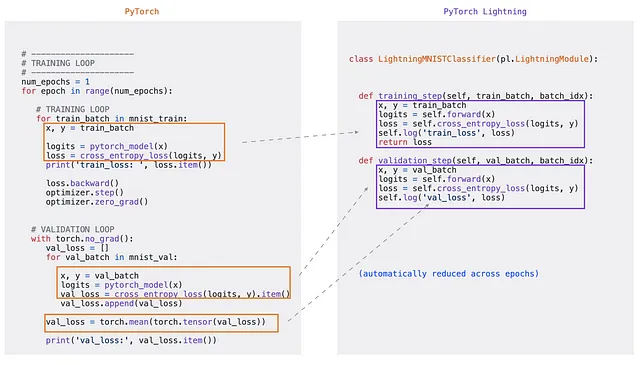

# Image Classification with Pytorch Lightning ⚡️

[](https://huggingface.co/spaces/Diegulio/breed-classification)
[](https://github.com/diegulio/pytorch-breed-classification)

# ⚡️ Tópico: Breed Classification with Pytorch Lightning

En este post, resolveremos un problema clásico de Machine Learning: **Clasificación**. Lo interesante, es que no será un problema tabular, si no que será un problema de **Computer Vision** 👁️. Esto quiere decir que utilizaremos modelos de Deep Learning para clasificar imágenes dentro de un set de categorias (o clases) pre-definidas. Si bien es un problema clásico, el hecho de que la entrada de nuestro modelo sean imágenes hace todo el tema mucho más motivante, y es un buen punto de partida para escalar y luego resolver problemas tales como: Object detection, Segmentation, Image generation, entre otros.

> [!NOTE]
> Este post busca enseñar la implementación más que los detalles teóricos. Si bien la teoría es muy importante, en este caso, al ser una implementación más avanzada, me centraré en ella.

# 🔎 Motivación: Find your pet

Imaginemos tenemos una página web en donde las personas pueden subir carteles de sus mascotas perdidas, y a la vez carteles de sus mascotas encontradas. Una característica importante en tu página web sería tener un buen algoritmo de recomendación que logre hacer match entre estas mascotas. Algo que podría ayudar, es poder identificar correctamente la raza de la mascota (a veces los usuarios no saben de que raza es su mascota).

De hecho, el modelo que elaboraremos aquí puede servir para más que simplemente identificar la raza de la mascota. En realidad nuestro modelo podrá utilizarse para generar **Embeddings**, i.e formas de representar una imagen vectorialmente en una dimensión menor. Esto puede ser utilizado directamente en sistemas de recomendación, recomendando aquellas mascotas encontradas que tengan embeddings cercanos al embedding de la mascota que estamos buscando.

🧠 **Solución: Crear un modelo de clasificación de imágenes para detectar si una imagen corresponde a: Alguna raza de perro, gato o ninguno.**

# 🔨 Tool Path: Que utilizaremos

1. **Pytorch**: es una biblioteca de código abierto para el desarrollo de aplicaciones de aprendizaje profundo y la investigación en inteligencia artificial.
2. **Pytorch Lightning**: es una extensión de PyTorch que simplifica y estandariza el proceso de entrenamiento y desarrollo de modelos de aprendizaje profundo en PyTorch, facilitando la creación de código limpio y modular.
3. **Weight and Biases**: plataforma que permite realizar un seguimiento, visualización y colaboración en proyectos de Machine Learning.
4. **Timm**: biblioteca que proporciona una amplia variedad de modelos de redes neuronales pre-entrenados para tareas de computer vision en PyTorch.
5. **Gradio**: facilita la creación de interfaces de usuario interactivas para modelos de Machine Learning.

# 💭 Concept Path: Que aprenderemos

1. Convolutional Neural Networks
2. Transfer Learning
3. Data Augmentation
4. Early Stopping
5. Learning rate scheduling

# ♟️ Estrategia: Como abordamos

1. Recolectar datos: Buscar nuestras imágenes y sus respectivas etiquetas.
2. Definir una linea base: Un modelo fácil y rápido.
3. Aplicaremos otros modelos (usualmente más complejos): Creamos un benchmark para nuestro caso de uso.
4. Iteramos: Iteramos aplicando distintas técnicas, buscando mejorar nuestros resultados.
5. Deploy: Desplegamos nuestra aplicación para que sea utilizada por el público.

# 🧠 Prototyping

Recordar que en esta ocasión utilizaremos **Pytorch Lightning**. Esta herramienta es un wrapper de Pytorch, que nos permite reducir la duplicidad de código y aumentar la modularidad. En otras palabras, es más fácil crear las rutinas de entrenamiento.



En resumen, Pytorch Lightning hace por nosotros un montón de cosas como: el loop de epochs, utilizar gpu o no, calcular o no gradientes, computar métricas a través de cada paso, etc.

Lo que necesitamos es muy similar a lo que se necesita en Pytorch puro:

1. **Una clase Dataset**: clase que facilita el acceso a la data.
2. **Un Dataloader**: La forma en como los datos son cargados al momento de entrenar.
3. **Una clase Modelo**: Acá indicamos de que se compone nuestro modelo, las capas que utiliza, el optimizador, la predicción, etc.
4. Todo lo anterior es utilizado en la clase **Trainer** de Pytorch Lightning.

```python
import torch

# 1. Dataset
class MyDataset:
    """¿Como consulto mi dataset?"""
    pass

dataset = MyDataset()

# 2. Dataloader -> como cargo mis datos
dataloader = DataLoader(dataset)

# 3. Modelo
class MyModel:
    """¿Cual es la arquitectura de mi modelo? ¿Cómo pasan las imagenes através de mi modelo?"""
    pass

modelo = MyModel()

# 4. Trainer
trainer = Trainer()  # Algunas configuraciones de entrenamiento

# 5. Fit
trainer.fit(modelo, train_dataloader, val_dataloader)

# 6. Evaluate
trainer.evaluate(modelo, test_dataloader)
```

## Config

```python
class CFG:
    IMG_PATH = 'PATH/TO/IMAGES'
    LABEL_PATH = '/PATH/TO/labels.csv'
    TEST_SIZE = 0.2
    VAL_SIZE = 0.1
```

## 1. Dataset

Al ser un problema supervisado, necesitaremos imágenes y sus respectivas etiquetas. Extraje una base de datos de Stanford de razas de perro, un dataset de Kaggle de gatos, y descargué manualmente algunas imágenes pseudo-aleatorias. Juntando todo esto creé un dataset con las siguientes clases:

- 120 razas de perro
- Gato
- No detectado

Lo que tenemos es una carpeta con cientos de imágenes, y un archivo `.csv` que nos indica la clase según el nombre de la imagen:


### Split

```python
from sklearn.model_selection import train_test_split

labels = pd.read_csv(CFG.LABEL_PATH)
X = labels.id
y = labels.breed

X_train, X_test, y_train, y_test = train_test_split(X, y, test_size=CFG.TEST_SIZE, random_state=13, shuffle=True, stratify=y)
X_train, X_val, y_train, y_val = train_test_split(X_train, y_train, test_size=CFG.VAL_SIZE, random_state=13, shuffle=True, stratify=y_train)

train_labels = pd.concat([X_train, y_train], axis=1).reset_index(drop=True)
val_labels = pd.concat([X_val, y_val], axis=1).reset_index(drop=True)
test_labels = pd.concat([X_test, y_test], axis=1).reset_index(drop=True)
```

### Pytorch Dataset

Para crear una clase Dataset personalizada en Pytorch, se necesitan 3 métodos fundamentales:

1. **`__init__`**: Inicializamos el directorio de imágenes, el archivo de anotaciones y transformaciones.
2. **`__len__`**: Devuelve el número de muestras en el conjunto de datos.
3. **`__getitem__`**: Carga y devuelve una muestra del conjunto de datos en el índice *idx* dado.

```python
from torch.utils.data import Dataset

class PetDataSet(Dataset):
    def __init__(self, config, labels, transform):
        self.labels = labels
        self.dir = config.IMG_PATH
        self.config = config
        self.transform = transform

    def __len__(self):
        return len(self.labels)

    def __getitem__(self, idx):
        breed = self.labels.iloc[idx, 1]
        class_id = self.config.class_to_idx[breed]
        img_path = self.labels.iloc[idx, 0]
        full_path = os.path.join(self.dir, f'{img_path}.jpg')
        image = read_image(full_path) / 255
        img = self.transform(image)
        return img, class_id
```

> [!NOTE]
> Tomamos las imágenes y las convertimos a píxeles (números). Además, le asignamos un número entero (índice) a cada clase para que el modelo pueda trabajar: `dalmata → 0`.

Para el diccionario de clases:

```python
class CFG:
    # ...
    labels = pd.read_csv(LABEL_PATH)
    idx_to_class = dict(enumerate(labels.breed.unique()))  # id -> clase
    class_to_idx = {c: i for i, c in idx_to_class.items()}  # clase -> id
```

## 2. DataLoader

El modelo irá recibiendo las imágenes en **batches**, no una por una ni todas a la vez:

```python
from torch.utils.data import DataLoader

train_dataloader = DataLoader(train_dataset, batch_size=64, shuffle=True, num_workers=1)
val_dataloader = DataLoader(val_dataset, batch_size=64, shuffle=False, num_workers=1)
test_dataloader = DataLoader(test_dataset, batch_size=64, shuffle=False, num_workers=1)
```

## 3. Model

Para el modelo, utilizaremos **Transfer Learning**.

> [!NOTE]
> **Transfer learning** es una técnica en la que se aprovecha el conocimiento adquirido por un modelo entrenado en una tarea específica y se aplica a una tarea relacionada. En lugar de entrenar un modelo desde cero, se toma un modelo pre-entrenado y se ajusta para adaptarse a la nueva tarea. Esto a menudo ahorra tiempo y recursos, y puede resultar en un rendimiento mejorado, especialmente cuando los datos de entrenamiento son limitados.


El procedimiento será el siguiente:

1. Tomamos una arquitectura base (Backbone)
2. Sustituimos la sección de clasificación por una propia.
3. Congelamos los parámetros del modelo pre-entrenado.
4. Entrenamos con nuestra data.


### TIMM (pyTorch Image Models)

Probaremos algunos de los modelos más conocidos: **EfficientNet, VGG, Inception y ResNet**.

```python
import timm
base_model = timm.create_model("inception_v4", pretrained=True, num_classes=len(CFG.idx_to_class))
```

### Pytorch Lightning ⚡️

```python
class PetRecognitionModel(L.LightningModule):
    def __init__(self, base_model, config):
        super().__init__()
        self.config = config
        self.num_classes = len(self.config.idx_to_class)
        self.metric = Accuracy(task="multiclass", num_classes=self.num_classes)
        self.pretrained_model = base_model

    def forward(self, x):
        return self.pretrained_model(x)

    def training_step(self, batch, batch_idx):
        x, y = batch
        logits = self.forward(x)
        loss = F.cross_entropy(logits, y)
        self.log_dict({'train_loss': loss})
        return loss

    def configure_optimizers(self):
        optimizer = optim.Adam(self.parameters(), lr=self.config.LEARNING_RATE)
        lr_scheduler = ReduceLROnPlateau(optimizer, mode='min', patience=3)
        lr_scheduler_dict = {
            "scheduler": lr_scheduler,
            "interval": "epoch",
            "monitor": "val_loss",
        }
        return {'optimizer': optimizer, 'lr_scheduler': lr_scheduler_dict}
```

Para congelar los parámetros:

```python
def freeze_pretrained_layers(model, model_name):
    for param in model.parameters():
        param.requires_grad = False

    if model_name == 'inception_v4':
        model.pretrained_model.last_linear.weight.requires_grad = True
        model.pretrained_model.last_linear.bias.requires_grad = True
```

## 4. Trainer

```python
trainer = L.Trainer(
    accelerator=CFG.ACCELERATOR,
    devices=1,
    min_epochs=CFG.MIN_EPOCHS,
    max_epochs=CFG.MAX_EPOCHS,
    precision=CFG.PRECISION,
    logger=wandb_logger,
)
```

## 5. Fit

```python
trainer.fit(model, train_dataloader, val_dataloader)
```


Observemos que la cantidad total de parámetros es de 43.3 Millones. Aún así nosotros sólo entrenamos 2.1 Millones, y el resto lo congelamos 🥶

## 6. Evaluate

```python
trainer.test(model, test_dataloader)
```


# 🎯 Resultados

Todos los resultados los puedes ver en el [panel de Wandb](https://wandb.ai/diegulio/breed-classification-pytorch/workspace?workspace=user-diegulio) 🐝!


Vemos que **Inception_v4** se queda con el trono 👑 con un accuracy de **85%** con sólo 3 epochs — gracias al Transfer Learning.


Luego de agregar Data Augmentation y otras técnicas, el accuracy final fue de **89%**.

# 🧐 Front-End

> [!NOTE]
> [Prueba la aplicación acá](https://huggingface.co/spaces/Diegulio/breed-classification) !!

Utilizamos **Gradio** para crear la aplicación:

```python
import gradio as gr
import torch

def predict(x):
    x = pred_transforms(x).unsqueeze(0).to(device)
    with torch.no_grad():
        prediction = torch.nn.functional.softmax(model(x)[0], dim=0)
        confidences = {CFG.idx_to_class[i]: float(prediction[i]) for i in range(len(CFG.idx_to_class))}
    return confidences

gr.Interface(
    fn=predict,
    title="Breed Classifier 🐶🧡🐱",
    description="Clasifica una imagen entre: 120 razas, gato o ninguno!",
    inputs=gr.Image(type="pil"),
    outputs=gr.Label(num_top_classes=5),
).launch()
```


# 🚀 Próximos Pasos

- **Unfreeze more layers**: Descongelar más capas, efectivo cuando la tarea base es muy distinta a la tarea objetivo.
- **Más Data Augmentation**: Para mejorar la generalización del modelo.
- **Agregar más layers**: En la parte de clasificación para capturar patrones más complejos.
- **Data Oriented**: Mejorar la calidad de los datos, hay algunas imágenes mal etiquetadas.
- **Transformers**: Probar los nuevos modelos de computer vision basados en transformers (ViT).

# 🥳 Conclusión

En este blog hemos abordado un desafío de clasificación de imágenes que abarca 120 razas de perros, la categoría de gato y la opción "No detectado". Hemos demostrado cómo PyTorch Lightning y la técnica de transfer learning pueden simplificar drásticamente el proceso de desarrollo y entrenamiento de modelos de Convolutional Neural Networks (CNN) preentrenados.

Con solo 3 epochs de entrenamiento, logramos un 85% de accuracy — todo gracias al poder del Transfer Learning y la eficiencia de Pytorch Lightning.

> [!NOTE]
> Conclusión creada con ayuda de ChatGPT 😄
